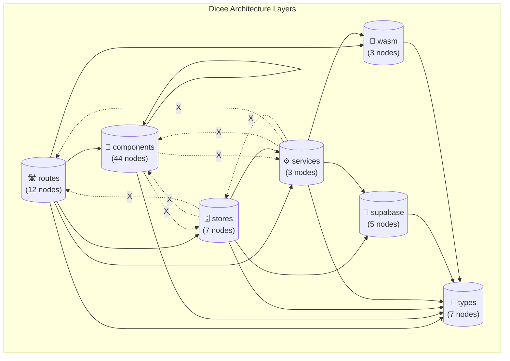
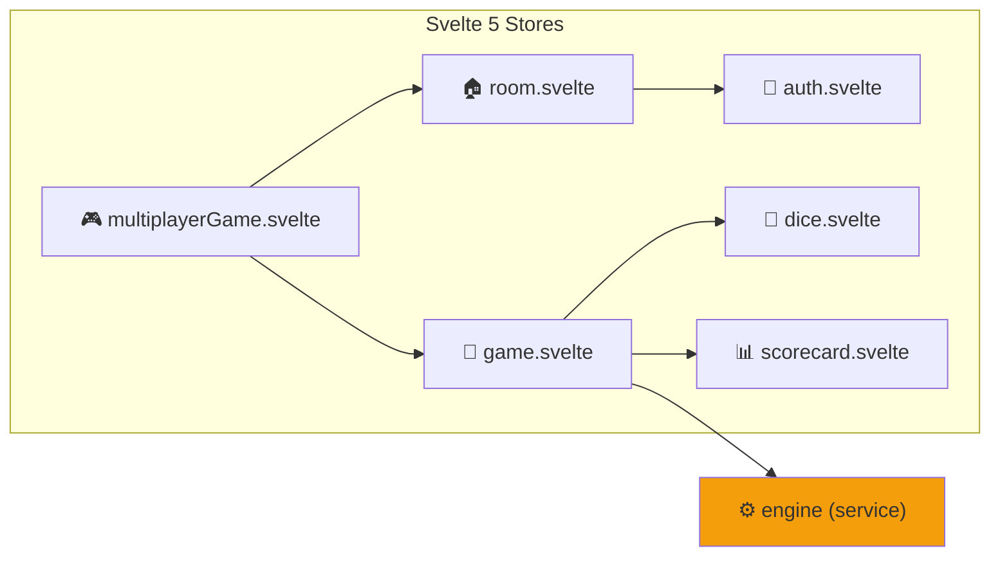
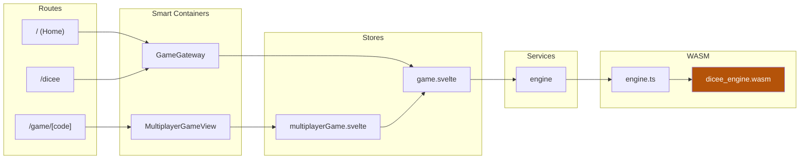

# RFC: AKG Mermaid Visualization Architecture

> **Version**: 1.0.0
> **Created**: 2025-12-07
> **Status**: Approved - Implementation Ready
> **Author**: Claude Opus 4.5 + Human Collaboration
> **Decisions**: Finalized 2025-12-07

---

## Table of Contents

1. [Executive Summary](#1-executive-summary)
2. [Problem Statement](#2-problem-statement)
3. [Current Integration Landscape](#3-current-integration-landscape)
4. [Mapping Paradigm: AKG Graph → Mermaid](#4-mapping-paradigm-akg-graph--mermaid)
5. [Visualization Design](#5-visualization-design)
6. [Agentic Integration Pattern](#6-agentic-integration-pattern)
7. [Human Developer Experience](#7-human-developer-experience)
8. [Implementation Architecture](#8-implementation-architecture)
9. [Open Questions](#9-open-questions)

---

## 1. Executive Summary

### 1.1 Purpose

This RFC defines how the Architectural Knowledge Graph (AKG) integrates with Mermaid visualization to provide **self-documenting architecture** that:
- Auto-updates with code changes
- Serves both human developers and AI agents
- Integrates with MCP-first agentic development patterns
- Maintains consistency across the project workflow

### 1.2 Key Design Decisions Needed

| Decision | Options | Impact |
|----------|---------|--------|
| **Diagram storage** | Markdown files vs. generated HTML vs. live dashboard | How humans access diagrams |
| **Update trigger** | On discover, pre-commit, CI, manual | Staleness risk vs. overhead |
| **MCP integration** | Query tool, memory entities, or read-only | Agent capabilities |
| **Abstraction levels** | Single view vs. multiple zoom levels | Comprehension vs. maintenance |

---

## 2. Problem Statement

### 2.1 Current Gap

The AKG system is **self-aware but not visually self-documenting**:

```
┌─────────────────────────────────────────────────────────────┐
│                    CURRENT STATE                            │
│                                                             │
│  AKG Discovery → JSON Graph → SARIF → GitHub Code Scanning  │
│       ↓                                                     │
│  136 nodes, 230 edges                                       │
│       ↓                                                     │
│  ??? (No human-readable visualization)                      │
│                                                             │
└─────────────────────────────────────────────────────────────┘
```

### 2.2 Questions This RFC Must Answer

1. **How does AKG tie to project workflow structure?**
2. **How does agentic development ensure structure is maintained?**
3. **Are we using MCP-first patterns for December 2025?**
4. **Do we have true integration across these aspects?**
5. **What mapping paradigm exists between AKG and Mermaid?**
6. **How will diagrams be designed to be useful?**
7. **How will human developers see the diagrams?**

---

## 3. Current Integration Landscape

### 3.1 System Components

```
┌─────────────────────────────────────────────────────────────────────┐
│                    DICEE AGENTIC DEVELOPMENT SYSTEM                 │
│                                                                     │
│  ┌─────────────┐    ┌─────────────┐    ┌─────────────┐              │
│  │  Workflow   │    │    MCP      │    │    AKG      │              │
│  │Orchestration│◄──►│   Memory    │◄──►│   Graph     │              │
│  └─────────────┘    └─────────────┘    └─────────────┘              │
│        │                  │                  │                      │
│        ▼                  ▼                  ▼                      │
│  ┌─────────────┐    ┌─────────────┐    ┌─────────────┐              │
│  │State Files  │    │  58 Entity  │    │ 136 Nodes   │              │
│  │ (.claude/)  │    │Knowledge Gr.│    │ 230 Edges   │              │
│  └─────────────┘    └─────────────┘    └─────────────┘              │
│        │                  │                  │                      │
│        └──────────────────┼──────────────────┘                      │
│                           │                                         │
│                           ▼                                         │
│                    ┌─────────────┐                                  │
│                    │Quality Gate │                                  │
│                    │(6 steps)    │                                  │
│                    └─────────────┘                                  │
│                           │                                         │
│                           ▼                                         │
│                    ┌─────────────┐                                  │
│                    │GitHub SARIF │                                  │
│                    │Code Scanning│                                  │
│                    └─────────────┘                                  │
│                                                                     │
│                    ┌─────────────┐                                  │
│                    │  MISSING:   │                                  │
│                    │  Visual     │                                  │
│                    │  Diagrams   │                                  │
│                    └─────────────┘                                  │
└─────────────────────────────────────────────────────────────────────┘
```

### 3.2 What Exists Today

| Component | Purpose | Status |
|-----------|---------|--------|
| **Workflow Orchestration** | Defines phases, tasks, handoffs | v2.1.0 Complete |
| **MCP Memory** | 58 entities for project knowledge | Active |
| **AKG Discovery** | 136 nodes, 230 edges from source | Week 5 Complete |
| **AKG Query Engine** | O(1) lookups, cycle detection | Complete |
| **AKG Invariants** | 6 rules enforcing architecture | Complete |
| **SARIF Output** | GitHub Code Scanning integration | Complete |
| **Session Hooks** | Init, finalize, tool logging | Complete |
| **Quality Gate** | 6-step enforcement | Complete |
| **Mermaid Visualization** | Human-readable diagrams | **MISSING** |

### 3.3 Integration Quality Assessment

| Integration | Quality | Notes |
|-------------|---------|-------|
| Workflow ↔ State Files | ✅ Strong | Hooks ensure consistency |
| State Files ↔ MCP Memory | ⚠️ Partial | Manual sync, could be automated |
| AKG ↔ Quality Gate | ✅ Strong | Step 2 of quality-gate.sh |
| AKG ↔ GitHub CI | ✅ Strong | SARIF upload automated |
| AKG ↔ MCP Memory | ❌ Weak | No query bridge exists |
| AKG ↔ Human Docs | ❌ Missing | No visualization layer |

---

## 4. Mapping Paradigm: AKG Graph → Mermaid

### 4.1 AKG Graph Structure

**Node Types (13):**
```
Module (57)        → Generic TypeScript files
Component (24)     → Svelte components (dumb)
SmartContainer (11)→ Components with store/service imports
Store (9)          → Svelte 5 rune stores
Type (9)           → Type definitions
Layer (7)          → Virtual architectural layers
Route (6)          → SvelteKit pages
SupabaseModule (5) → Supabase client/helpers
WASMBridge (4)     → WASM bridge files
Package (2)        → Package boundaries
Service (2)        → Business logic
Layout (1)         → SvelteKit layout
PartyKitServer (1) → PartyKit entry
```

**Edge Types (9):**
```
belongs_to (81)      → Node → Layer membership
imports (58)         → ES module imports
imports_type (48)    → Type-only imports
allowed_import (16)  → Layer → Layer allowed
forbidden_import (11)→ Layer → Layer forbidden
calls_wasm (5)       → WASM function calls
dynamic_imports (4)  → Dynamic import()
subscribes_to (4)    → Store subscriptions
calls_service (3)    → Service method calls
```

### 4.2 Mermaid Diagram Types

| Mermaid Type | Best For | AKG Mapping |
|--------------|----------|-------------|
| `flowchart` | Directed graphs, data flow | Layer deps, imports |
| `classDiagram` | UML-style relationships | Module structure |
| `mindmap` | Hierarchies | Component nesting |
| `stateDiagram` | State machines | N/A |
| `erDiagram` | Entity relationships | Node/edge schema |
| `quadrantChart` | 2x2 analysis | Layer violations |

### 4.3 Proposed Mapping Strategy

```
┌─────────────────────────────────────────────────────────────────────┐
│                    MAPPING PARADIGM                                 │
│                                                                     │
│  AKG Node Types         →    Mermaid Representation                │
│  ─────────────────────────────────────────────────────────────────  │
│                                                                     │
│  Layer (7)              →    Subgraph containers                   │
│  Component (24)         →    Rounded rectangles (blue)             │
│  SmartContainer (11)    →    Double-bordered rectangles (purple)   │
│  Store (9)              →    Cylinders (green)                     │
│  Service (2)            →    Hexagons (orange)                     │
│  Module (57)            →    Rectangles (gray)                     │
│  Route (6)              →    Stadium shapes (teal)                 │
│  WASMBridge (4)         →    Trapezoid (rust/brown)                │
│                                                                     │
│  AKG Edge Types         →    Mermaid Representation                │
│  ─────────────────────────────────────────────────────────────────  │
│                                                                     │
│  imports                →    Solid arrow (→)                       │
│  imports_type           →    Dotted arrow (-.->)                   │
│  subscribes_to          →    Thick arrow (==>)                     │
│  calls_service          →    Arrow with label                      │
│  calls_wasm             →    Dashed arrow with icon                │
│  allowed_import         →    Green arrow                           │
│  forbidden_import       →    Red dashed arrow                      │
│                                                                     │
└─────────────────────────────────────────────────────────────────────┘
```

### 4.4 Abstraction Levels

**Level 1: Layer Architecture** (7 nodes)
- Shows only Layer nodes
- Shows allowed_import and forbidden_import edges
- Purpose: High-level architecture overview

**Level 2: Layer Contents** (per layer, ~20 nodes each)
- Shows all nodes within a single layer
- Shows imports and type imports between them
- Purpose: Understanding a specific layer

**Level 3: Cross-Layer Data Flow** (~30 nodes)
- Shows key nodes: Routes → SmartContainers → Stores → Services → WASM
- Filtered to show only "hot paths"
- Purpose: Understanding data flow

**Level 4: Store Dependency Graph** (9 nodes)
- Shows only Store nodes
- Shows all edges between stores
- Purpose: Detecting/verifying no cycles

**Level 5: Full Graph** (138 nodes)
- Complete graph (may be overwhelming)
- Filterable by node type, layer, package
- Purpose: Deep exploration (interactive only)

---

## 5. Visualization Design

### 5.1 Visual Design Principles

1. **Color Consistency**: Same colors across all diagrams
2. **Shape Semantics**: Shape indicates node type
3. **Edge Weight**: Thickness indicates importance/frequency
4. **Clustering**: Subgraphs for layers
5. **Readability**: Max 20-30 nodes per static diagram
6. **Annotations**: Show violations in red

### 5.2 Color Palette

```css
/* Node Type Colors */
--component:        #3B82F6;  /* Blue */
--smart-container:  #8B5CF6;  /* Purple */
--store:            #10B981;  /* Green */
--service:          #F59E0B;  /* Orange */
--module:           #6B7280;  /* Gray */
--route:            #14B8A6;  /* Teal */
--wasm:             #B45309;  /* Rust Brown */
--type:             #EC4899;  /* Pink */
--layer:            #1F2937;  /* Dark Gray (container) */

/* Edge Colors */
--imports:          #6B7280;  /* Gray */
--allowed:          #10B981;  /* Green */
--forbidden:        #EF4444;  /* Red */
--subscribes:       #8B5CF6;  /* Purple */
--calls:            #F59E0B;  /* Orange */
```

### 5.3 Diagram Specifications

#### Diagram 1: Layer Architecture


#### Diagram 2: Store Dependency Graph


#### Diagram 3: Data Flow (Route to WASM)


---

## 6. Agentic Integration Pattern

### 6.1 December 2025 MCP-First Patterns

The current system partially implements MCP-first patterns:

| Pattern | Current Status | Gap |
|---------|---------------|-----|
| **MCP Memory for state** | ✅ 58 entities in memory.jsonl | Need AKG node entities |
| **MCP Supabase for DB** | ✅ Full database access | None |
| **Tool discovery** | ⚠️ No AKG query tool | Need MCP bridge |
| **Persistent knowledge** | ✅ Session handoffs work | None |
| **Agent specialization** | ✅ Role definitions exist | None |

### 6.2 Proposed AKG MCP Integration

**Option A: Add AKG entities to MCP Memory**
```jsonl
{"type":"entity","name":"akg::layer::stores","entityType":"AKGLayer","observations":["Contains 7 Store nodes","No circular dependencies detected"]}
{"type":"entity","name":"akg::node::game.svelte","entityType":"AKGNode","observations":["Store type","Imports: dice.svelte, scorecard.svelte, engine"]}
```

**Pros**: Agents can query graph knowledge naturally
**Cons**: Duplication with current.json, sync complexity

**Option B: File-based query via Bash**
```bash
# Agent queries graph via jq
cat docs/architecture/akg/graph/current.json | jq '.nodes[] | select(.type == "Store")'
```

**Pros**: No new infrastructure, current.json is source of truth
**Cons**: Requires Bash tool, not "MCP-native"

**Option C: Custom AKG MCP Server (Future)**
```json
{
  "akg": {
    "command": "node",
    "args": ["./packages/web/src/tools/akg/mcp/server.js"],
    "env": {
      "GRAPH_PATH": "./docs/architecture/akg/graph/current.json"
    }
  }
}
```

**Pros**: True MCP integration, structured queries
**Cons**: Implementation overhead, maintenance

### 6.3 Approved Approach (REVISED)

**Phase 1 (Implement Now)**: AKG MCP Server + Integrated Diagrams
- Custom MCP server with structured query tools
- `pnpm akg:discover` atomically updates graph + diagrams
- Diagrams committed with hash verification
- CI gate on hash match
- Markdown + JSON sidecar output format

**Phase 2 (Soon)**: Enhanced Agent Queries
- Path analysis: "what happens if X imports Y"
- Violation explanation: "why is this edge forbidden"
- Dependency impact: "what breaks if I change this store"

**Phase 3 (Later)**: Interactive Explorer
- D3.js dashboard at /admin/architecture
- Full graph with filtering
- Real-time invariant status

### 6.4 AKG MCP Server Query Tools

| Tool | Purpose | Agent Use Case |
|------|---------|----------------|
| `akg_layer_rules` | Get allowed/forbidden imports for a layer | "Can I import X here?" |
| `akg_node_info` | Get node type, layer, edges | "What is this file?" |
| `akg_check_import` | Validate a proposed import | Pre-flight check before writing code |
| `akg_invariant_status` | Current pass/fail state | Quality gate awareness |
| `akg_diagram` | Get specific diagram content | Architecture context for planning |
| `akg_path_find` | Find dependency path between nodes | Impact analysis |

This makes the AKG genuinely *queryable* at agent decision points, not just reportable after the fact.

### 6.5 Ensuring Structure is Maintained

**Current Enforcement:**
1. **Quality Gate** → `pnpm akg:check` runs 6 invariants
2. **GitHub CI** → SARIF upload annotates violations
3. **Pre-commit** → Could add diagram regeneration

**Proposed Additions:**
1. **Diagram staleness check** → CI verifies diagrams match current graph
2. **Hook integration** → PostToolUse could update affected diagrams
3. **Session handoff** → Include "diagram status" in handoff notes

---

## 7. Human Developer Experience

### 7.1 Where Humans See Diagrams

| Location | Pros | Cons |
|----------|------|------|
| **GitHub** | Auto-rendered, PR context | Slow to update |
| **VS Code** | Live preview with extension | Requires extension |
| **Obsidian** | Interactive, linked notes | Not all use Obsidian |
| **Static HTML** | Self-contained, shareable | Separate deploy needed |
| **In-app** | Always current | Scope creep |

**Recommendation**: GitHub Markdown as primary, VS Code for local dev

### 7.2 File Structure

```
docs/architecture/akg/
├── graph/
│   ├── current.json              # Raw graph (source of truth)
│   └── history/                  # Snapshots
├── diagrams/                     # NEW: Generated Mermaid
│   ├── README.md                 # Index with all diagrams
│   ├── LAYER_ARCHITECTURE.md     # 7-layer overview
│   ├── STORE_DEPENDENCIES.md     # Store relationships
│   ├── DATA_FLOW.md              # Route → WASM flow
│   ├── COMPONENT_HIERARCHY.md    # Smart/dumb containers
│   └── INVARIANT_STATUS.md       # Pass/fail visualization
├── invariants/                   # Invariant documentation
├── AUTHORING_INVARIANTS.md
├── WEEK_1_2_SCHEMA_INFRASTRUCTURE.md
├── WEEK_4_VISUALIZATION_REPORTING.md
├── WEEK_5_CI_INTEGRATION.md
└── RFC_MERMAID_VISUALIZATION.md  # This document
```

### 7.3 Diagram Freshness

Each generated diagram includes:
```markdown
<!-- Generated by AKG Mermaid Output -->
<!-- Source: docs/architecture/akg/graph/current.json -->
<!-- Commit: abc1234 -->
<!-- Generated: 2025-12-07T03:15:00Z -->
<!-- Node count: 138 | Edge count: 230 -->
```

**Staleness detection**:
```bash
# In quality-gate.sh
if [ "$GRAPH_COMMIT" != "$DIAGRAM_COMMIT" ]; then
  echo "⚠️ Diagrams are stale. Run: pnpm akg:mermaid"
fi
```

---

## 8. Implementation Architecture

### 8.1 New Files

```
packages/web/src/tools/akg/
├── output/
│   ├── sarif.ts                  # Existing
│   └── mermaid.ts                # NEW: Mermaid generator
├── cli/
│   ├── discover.ts               # Existing
│   ├── check.ts                  # Existing
│   └── mermaid.ts                # NEW: CLI entry point
```

### 8.2 Mermaid Output Module API

```typescript
// packages/web/src/tools/akg/output/mermaid.ts

export interface MermaidOptions {
  /** Output directory for generated markdown */
  outputDir: string;
  /** Abstraction level: 'layer' | 'store' | 'dataflow' | 'component' | 'full' */
  level?: string;
  /** Include node counts in labels */
  showCounts?: boolean;
  /** Show forbidden edges */
  showForbidden?: boolean;
  /** Max nodes before filtering */
  maxNodes?: number;
}

export interface MermaidOutput {
  filename: string;
  content: string;
  nodeCount: number;
  edgeCount: number;
}

/**
 * Generate all standard diagrams from graph
 */
export function generateAllDiagrams(
  graph: AKGGraph,
  options: MermaidOptions
): MermaidOutput[];

/**
 * Generate layer architecture diagram
 */
export function generateLayerDiagram(
  graph: AKGGraph,
  options: MermaidOptions
): MermaidOutput;

/**
 * Generate store dependency diagram
 */
export function generateStoreDiagram(
  graph: AKGGraph,
  options: MermaidOptions
): MermaidOutput;

/**
 * Generate data flow diagram
 */
export function generateDataFlowDiagram(
  graph: AKGGraph,
  options: MermaidOptions
): MermaidOutput;
```

### 8.3 CLI Integration

```bash
# New command
pnpm akg:mermaid [options]

Options:
  --output <dir>    Output directory (default: docs/architecture/akg/diagrams)
  --level <level>   Specific diagram: layer, store, dataflow, component, all
  --verbose         Show generation details
  --check           Verify diagrams are current (for CI)
```

### 8.4 package.json Script

```json
{
  "scripts": {
    "akg:mermaid": "bun run packages/web/src/tools/akg/cli/mermaid.ts"
  }
}
```

---

## 9. Decisions (FINALIZED)

### 9.1 Approved Decisions

| Question | Decision | Rationale |
|----------|----------|-----------|
| **1. Primary output format?** | **Markdown + JSON sidecar** | Markdown for humans/GitHub, JSON for agent queries |
| **2. Update trigger?** | **Atomic with discovery** | `pnpm akg:discover` updates graph AND diagrams together |
| **3. Commit strategy?** | **Commit with hash verification** | CI rejects if hash mismatch, PR diffs show architecture evolution |
| **4. Interactive diagram?** | **Static first, D3 roadmap** | Static covers 80%, D3 explorer at /admin/architecture later |
| **5. MCP integration level?** | **Custom AKG MCP Server (Phase 1)** | Enables real-time agent queries at decision points |

### 9.2 Resolved Scope Questions

| Question | Resolution |
|----------|------------|
| Commit diagrams to git? | **Yes** - with hash verification for staleness detection |
| PR diff visualization? | **Future** - not in Phase 1 |
| /docs embed diagrams? | **Yes** - README.md will include layer architecture |
| Diagram explorer in app? | **Phase 3** - /admin/architecture route with D3.js |

### 9.3 Implementation Roadmap

**Week 1: AKG MCP Server**
1. Create MCP server scaffold at `packages/web/src/tools/akg/mcp/`
2. Implement core query tools: `akg_layer_rules`, `akg_node_info`, `akg_check_import`
3. Add to `.mcp.json` configuration
4. Test agent interaction

**Week 2: Mermaid Output + Atomic Pipeline**
1. Implement `mermaid.ts` output module
2. Implement `mermaid-json.ts` for sidecar output
3. Integrate with discover CLI for atomic updates
4. Add hash verification to generated files

**Week 3: CI Integration + Documentation**
1. Add hash verification to quality-gate.sh
2. Update GitHub Actions workflow
3. Generate initial diagram set
4. Update CLAUDE.md with new workflow

---

## Appendix A: Sample Generated Diagram

```markdown
<!-- docs/architecture/akg/diagrams/LAYER_ARCHITECTURE.md -->
# Dicee Layer Architecture

> Auto-generated from AKG Graph
> Source: docs/architecture/akg/graph/current.json
> Commit: abc1234
> Generated: 2025-12-07T03:15:00Z

## Overview

The Dicee architecture enforces a strict layered dependency model with 7 layers
and 138 code nodes.

## Layer Dependency Diagram

\`\`\`mermaid
flowchart TB
    subgraph "Dicee Architecture"
        routes["🛣️ Routes (12)"]
        components["🧩 Components (44)"]
        stores["🗄️ Stores (7)"]
        services["⚙️ Services (3)"]
        types["📝 Types (7)"]
        supabase["🔌 Supabase (5)"]
        wasm["🦀 WASM (3)"]
    end

    routes --> components
    routes --> stores
    routes --> services
    routes --> types
    routes --> wasm

    components --> components
    components --> types

    stores --> services
    stores --> types
    stores --> supabase

    services --> types
    services --> supabase
    services --> wasm

    supabase --> types
    wasm --> types

    linkStyle 2,3,4,5,6,7,8,9,10,11,12,13,14,15 stroke:#10B981
\`\`\`

## Forbidden Dependencies

| From | May NOT Import | Invariant |
|------|---------------|-----------|
| components | stores, services | layer_component_isolation |
| stores | components, routes | store isolation |
| services | components, routes, stores | service_layer_boundaries |
| supabase | components, routes, stores, services | supabase isolation |

## Invariant Status

All 6 invariants passing as of last check.
```

---

## Appendix B: AKG MCP Server Specification

### B.1 Server Architecture

```
packages/web/src/tools/akg/mcp/
├── server.ts              # MCP server entry point
├── tools/
│   ├── layer-rules.ts     # akg_layer_rules implementation
│   ├── node-info.ts       # akg_node_info implementation
│   ├── check-import.ts    # akg_check_import implementation
│   ├── invariant-status.ts # akg_invariant_status implementation
│   ├── diagram.ts         # akg_diagram implementation
│   └── path-find.ts       # akg_path_find implementation
└── index.ts               # Exports
```

### B.2 MCP Configuration

```json
{
  "mcpServers": {
    "akg": {
      "command": "bun",
      "args": ["run", "./packages/web/src/tools/akg/mcp/server.ts"],
      "env": {
        "AKG_GRAPH_PATH": "./docs/architecture/akg/graph/current.json",
        "AKG_DIAGRAMS_PATH": "./docs/architecture/akg/diagrams"
      }
    }
  }
}
```

### B.3 Tool Specifications

#### `akg_layer_rules`

**Purpose**: Get allowed and forbidden imports for a layer

**Input Schema**:
```json
{
  "type": "object",
  "properties": {
    "layer": {
      "type": "string",
      "enum": ["routes", "components", "stores", "services", "types", "supabase", "wasm"],
      "description": "The architectural layer to query"
    }
  },
  "required": ["layer"]
}
```

**Output**:
```json
{
  "layer": "stores",
  "nodeCount": 7,
  "mayImport": ["services", "types", "supabase"],
  "mayNotImport": ["components", "routes"],
  "enforcingInvariants": ["store_no_circular_deps", "service_layer_boundaries"]
}
```

**Agent Use Case**:
```
Agent: "I'm creating a new store. What can it import?"
→ calls akg_layer_rules({ layer: "stores" })
→ Knows to avoid importing from components or routes
```

#### `akg_node_info`

**Purpose**: Get detailed information about a specific node

**Input Schema**:
```json
{
  "type": "object",
  "properties": {
    "filePath": {
      "type": "string",
      "description": "Relative file path from project root"
    }
  },
  "required": ["filePath"]
}
```

**Output**:
```json
{
  "id": "store::game.svelte::tores_game_svelte_ts",
  "type": "Store",
  "name": "game.svelte",
  "layer": "stores",
  "package": "@dicee/web",
  "imports": [
    { "target": "dice.svelte", "type": "imports" },
    { "target": "scorecard.svelte", "type": "imports" },
    { "target": "engine", "type": "calls_service" }
  ],
  "importedBy": [
    { "source": "multiplayerGame.svelte", "type": "imports" },
    { "source": "GameGateway", "type": "subscribes_to" }
  ],
  "exports": ["gameState", "createGame", "resetGame"],
  "usesRunes": true
}
```

#### `akg_check_import`

**Purpose**: Pre-flight validation of a proposed import

**Input Schema**:
```json
{
  "type": "object",
  "properties": {
    "fromFile": {
      "type": "string",
      "description": "File that would contain the import"
    },
    "toFile": {
      "type": "string",
      "description": "File being imported"
    }
  },
  "required": ["fromFile", "toFile"]
}
```

**Output**:
```json
{
  "allowed": false,
  "reason": "Layer violation: components may not import stores",
  "fromLayer": "components",
  "toLayer": "stores",
  "violatesInvariant": "layer_component_isolation",
  "suggestion": "Pass data via props from a SmartContainer parent"
}
```

**Agent Use Case**:
```
Agent: "I want to import auth.svelte.ts into DiceRoller.svelte"
→ calls akg_check_import({ fromFile: "src/lib/components/game/DiceRoller.svelte", toFile: "src/lib/stores/auth.svelte.ts" })
→ Gets rejection with explanation and suggestion
→ Avoids writing code that would fail invariant checks
```

#### `akg_invariant_status`

**Purpose**: Get current pass/fail status of all invariants

**Input Schema**:
```json
{
  "type": "object",
  "properties": {
    "invariantId": {
      "type": "string",
      "description": "Optional: specific invariant to check"
    }
  }
}
```

**Output**:
```json
{
  "timestamp": "2025-12-07T03:15:00Z",
  "graphCommit": "abc1234",
  "summary": {
    "total": 6,
    "passing": 6,
    "failing": 0,
    "disabled": 0
  },
  "invariants": [
    {
      "id": "wasm_single_entry",
      "name": "WASM Single Entry Point",
      "status": "pass",
      "severity": "error",
      "violationCount": 0
    },
    {
      "id": "store_no_circular_deps",
      "name": "Store No Circular Dependencies",
      "status": "pass",
      "severity": "error",
      "violationCount": 0
    }
  ]
}
```

#### `akg_diagram`

**Purpose**: Get a specific diagram's content

**Input Schema**:
```json
{
  "type": "object",
  "properties": {
    "diagramType": {
      "type": "string",
      "enum": ["layer_architecture", "store_dependencies", "data_flow", "component_hierarchy"],
      "description": "Which diagram to retrieve"
    },
    "format": {
      "type": "string",
      "enum": ["mermaid", "json"],
      "default": "mermaid",
      "description": "Output format"
    }
  },
  "required": ["diagramType"]
}
```

**Output (mermaid)**:
```json
{
  "diagramType": "layer_architecture",
  "format": "mermaid",
  "content": "flowchart TB\\n  subgraph layers...",
  "nodeCount": 7,
  "edgeCount": 27,
  "generatedAt": "2025-12-07T03:15:00Z"
}
```

#### `akg_path_find`

**Purpose**: Find dependency path between two nodes

**Input Schema**:
```json
{
  "type": "object",
  "properties": {
    "fromNode": {
      "type": "string",
      "description": "Source node (file path or node ID)"
    },
    "toNode": {
      "type": "string",
      "description": "Target node (file path or node ID)"
    }
  },
  "required": ["fromNode", "toNode"]
}
```

**Output**:
```json
{
  "pathExists": true,
  "pathLength": 3,
  "path": [
    { "node": "GameGateway", "type": "SmartContainer" },
    { "edge": "subscribes_to" },
    { "node": "game.svelte", "type": "Store" },
    { "edge": "calls_service" },
    { "node": "engine", "type": "Service" }
  ],
  "alternativePaths": 1
}
```

### B.4 Error Handling

All tools return structured errors:

```json
{
  "error": true,
  "code": "NODE_NOT_FOUND",
  "message": "No node found for path: src/lib/components/Foo.svelte",
  "suggestion": "Check if file exists or run pnpm akg:discover"
}
```

Error codes:
- `NODE_NOT_FOUND` - File not in graph
- `LAYER_NOT_FOUND` - Invalid layer name
- `GRAPH_STALE` - Graph needs regeneration
- `INVARIANT_NOT_FOUND` - Unknown invariant ID

### B.5 Integration with Workflow

The AKG MCP server enables **proactive architecture awareness**:

```
┌─────────────────────────────────────────────────────────────────────┐
│                    AGENT DECISION FLOW                              │
│                                                                     │
│  1. Agent receives task: "Add user preferences store"               │
│                           │                                         │
│                           ▼                                         │
│  2. Agent queries:  akg_layer_rules("stores")                       │
│                           │                                         │
│                           ▼                                         │
│  3. Learns: Can import from services, types, supabase               │
│             Cannot import from components, routes                   │
│                           │                                         │
│                           ▼                                         │
│  4. Agent writes store with correct imports                         │
│                           │                                         │
│                           ▼                                         │
│  5. Runs: akg_check_import() for each proposed import               │
│                           │                                         │
│                           ▼                                         │
│  6. All checks pass → Writes code                                   │
│     Any check fails → Adjusts approach before writing               │
│                                                                     │
└─────────────────────────────────────────────────────────────────────┘
```

---

## Appendix C: Output File Structure

### C.1 Diagram Directory Layout

```
docs/architecture/akg/diagrams/
├── README.md                        # Index with embedded diagrams
├── LAYER_ARCHITECTURE.md            # 7-layer overview
├── LAYER_ARCHITECTURE.json          # JSON sidecar for agents
├── STORE_DEPENDENCIES.md            # Store relationships
├── STORE_DEPENDENCIES.json
├── DATA_FLOW.md                     # Route → WASM flow
├── DATA_FLOW.json
├── COMPONENT_HIERARCHY.md           # Smart/dumb containers
├── COMPONENT_HIERARCHY.json
└── INVARIANT_STATUS.md              # Current pass/fail status
```

### C.2 Markdown Header Format

```markdown
<!-- AKG Generated Diagram -->
<!-- Source: docs/architecture/akg/graph/current.json -->
<!-- Graph Hash: sha256:abc123def456... -->
<!-- Commit: abc1234 -->
<!-- Generated: 2025-12-07T03:15:00Z -->
<!-- Node Count: 7 | Edge Count: 27 -->
<!-- DO NOT EDIT MANUALLY - Regenerate with: pnpm akg:discover -->

# Layer Architecture

> Auto-generated from AKG Graph. Edit source, not this file.
```

### C.3 JSON Sidecar Format

```json
{
  "$schema": "https://dicee.games/schemas/akg-diagram.json",
  "version": "1.0.0",
  "diagramType": "layer_architecture",
  "generatedAt": "2025-12-07T03:15:00Z",
  "graphHash": "sha256:abc123def456...",
  "sourceCommit": "abc1234",
  "nodes": [
    { "id": "layer::routes", "label": "routes", "nodeCount": 12 },
    { "id": "layer::components", "label": "components", "nodeCount": 44 }
  ],
  "edges": [
    { "from": "layer::routes", "to": "layer::components", "type": "allowed_import" },
    { "from": "layer::components", "to": "layer::stores", "type": "forbidden_import" }
  ],
  "metadata": {
    "totalNodes": 7,
    "totalEdges": 27,
    "invariantsChecked": 6,
    "violationCount": 0
  }
}
```

---

**Document Status**: Approved - Ready for Implementation

**Implementation Owner**: Claude Opus 4.5 (architecture) + Human (review)

**First Milestone**: AKG MCP Server operational (Week 1)
