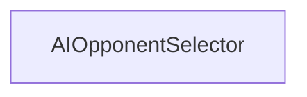

<!-- Auto-generated from AKG Graph. Edit source, not this file. -->
# Component Dependencies

> Auto-generated from AKG Graph
> Source: docs/architecture/akg/graph/current.json
> Commit: 15b429f
> Generated: 2025-12-16T17:30:14.405Z

## Component Dependency Diagram

Shows how Svelte components use each other.

## Component List (showing 1 of 1)

- **AIOpponentSelector**: `packages/web/src/lib/components/lobby/AIOpponentSelector.svelte`
