<!-- Auto-generated from AKG Graph. Edit source, not this file. -->
# Component Dependencies

> Auto-generated from AKG Graph
> Source: docs/architecture/akg/graph/current.json
> Commit: 49e593f
> Generated: 2025-12-09T05:51:36.378Z

## Component Dependency Diagram

Shows how Svelte components use each other.

```mermaid
flowchart LR
    component__Avatar__nts_ui_Avatar_svelte["Avatar"]
    component__BottomSheet__i_BottomSheet_sv["BottomSheet"]
    component__PlayerListItem__layerListItem["PlayerListItem"]
    component__EmptyRooms__by_EmptyRooms_sve["EmptyRooms"]
    component__Die__ents_dice_Die_svelte["Die"]
    component__DiceTray__dice_DiceTray_svelt["DiceTray"]
    component__OpponentPanel__OpponentPanel_["OpponentPanel"]
    component__MultiplayerGameOverModal__Gam["MultiplayerGameOverModal"]
    component__GameOverModal__GameOverModal_["GameOverModal"]
    component__EndGameSummary__ndGameSummary["EndGameSummary"]
    component__MultiplayerScorecard__ayerSco["MultiplayerScorecard"]
    component__TurnIndicator__TurnIndicator_["TurnIndicator"]
    component__GameHistory__e_GameHistory_sv["GameHistory"]
    component__SetupModal__le_SetupModal_sve["SetupModal"]
    component__StatsDashboard__tatsDashboard["StatsDashboard"]
    component__ProfileForm__e_ProfileForm_sv["ProfileForm"]
    component__Scorecard__ard_Scorecard_svel["Scorecard"]
    component__CategoryRow__d_CategoryRow_sv["CategoryRow"]
    component__HeroGame___hub_HeroGame_svelt["HeroGame"]
    component__NewsDev__s_hub_NewsDev_svelte["NewsDev"]
    component__Hub__nents_hub_Hub_svelte["Hub"]
    component__LobbyGate__hub_LobbyGate_svel["LobbyGate"]
    component__StatsToggle__d_StatsToggle_sv["StatsToggle"]
    component__GameStatus__ud_GameStatus_sve["GameStatus"]
    component__KeyboardHelp___KeyboardHelp_s["KeyboardHelp"]

```

## Component List (showing 25 of 25)

- **Avatar**: `packages/web/src/lib/components/ui/Avatar.svelte`
- **BottomSheet**: `packages/web/src/lib/components/ui/BottomSheet.svelte`
- **PlayerListItem**: `packages/web/src/lib/components/lobby/PlayerListItem.svelte`
- **EmptyRooms**: `packages/web/src/lib/components/lobby/EmptyRooms.svelte`
- **Die**: `packages/web/src/lib/components/dice/Die.svelte`
- **DiceTray**: `packages/web/src/lib/components/dice/DiceTray.svelte`
- **OpponentPanel**: `packages/web/src/lib/components/game/OpponentPanel.svelte`
- **MultiplayerGameOverModal**: `packages/web/src/lib/components/game/MultiplayerGameOverModal.svelte`
- **GameOverModal**: `packages/web/src/lib/components/game/GameOverModal.svelte`
- **EndGameSummary**: `packages/web/src/lib/components/game/EndGameSummary.svelte`
- **MultiplayerScorecard**: `packages/web/src/lib/components/game/MultiplayerScorecard.svelte`
- **TurnIndicator**: `packages/web/src/lib/components/game/TurnIndicator.svelte`
- **GameHistory**: `packages/web/src/lib/components/profile/GameHistory.svelte`
- **SetupModal**: `packages/web/src/lib/components/profile/SetupModal.svelte`
- **StatsDashboard**: `packages/web/src/lib/components/profile/StatsDashboard.svelte`
- **ProfileForm**: `packages/web/src/lib/components/profile/ProfileForm.svelte`
- **Scorecard**: `packages/web/src/lib/components/scorecard/Scorecard.svelte`
- **CategoryRow**: `packages/web/src/lib/components/scorecard/CategoryRow.svelte`
- **HeroGame**: `packages/web/src/lib/components/hub/HeroGame.svelte`
- **NewsDev**: `packages/web/src/lib/components/hub/NewsDev.svelte`
- **Hub**: `packages/web/src/lib/components/hub/Hub.svelte`
- **LobbyGate**: `packages/web/src/lib/components/hub/LobbyGate.svelte`
- **StatsToggle**: `packages/web/src/lib/components/hud/StatsToggle.svelte`
- **GameStatus**: `packages/web/src/lib/components/hud/GameStatus.svelte`
- **KeyboardHelp**: `packages/web/src/lib/components/hud/KeyboardHelp.svelte`
