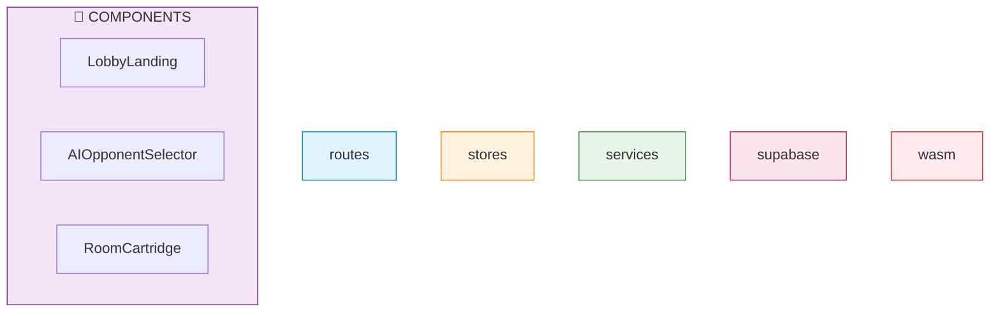

<!-- Auto-generated from AKG Graph. Edit source, not this file. -->
# Dataflow Architecture

> Auto-generated from AKG Graph
> Source: docs/architecture/akg/graph/current.json
> Commit: 15b429f
> Generated: 2025-12-16T17:30:14.405Z

## Data Flow Diagram

Shows how data flows through the application layers:
- **Routes** → Entry points (pages)
- **Components** → UI elements
- **Stores** → Reactive state
- **Services** → Business logic
- **External** → WASM engine, Supabase

## Layer Summary

| Layer | Nodes | Description |
|-------|-------|-------------|
| routes | 0 | SvelteKit page routes |
| components | 3 | Reusable UI components |
| stores | 0 | Svelte reactive stores |
| services | 0 | Business logic services |
| supabase | 0 | Database & auth integration |
| wasm | 0 | Rust/WASM probability engine |

## Key Data Paths

1. **Game State Flow**: Routes → Game Components → Game Store → Engine Service → WASM
2. **Auth Flow**: Routes → Auth Components → Auth Store → Supabase
3. **Multiplayer Flow**: Components → Room Store → PartyKit Service
