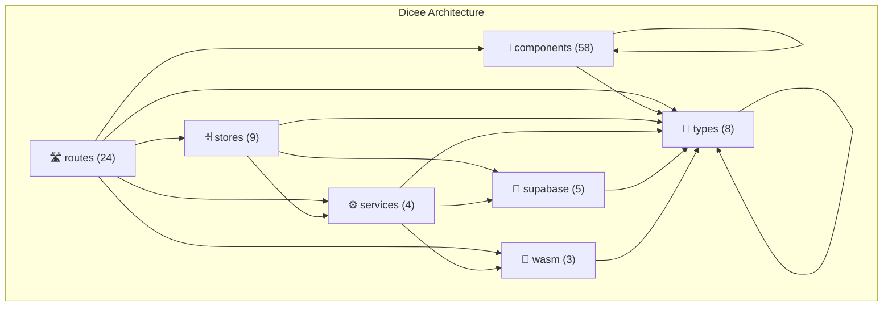

<!-- Auto-generated from AKG Graph. Edit source, not this file. -->
# Dicee Layer Architecture

> Auto-generated from AKG Graph
> Source: docs/architecture/akg/graph/current.json
> Commit: 10eb108e719d215041576d9d54d8f7e44a2e864a
> Generated: 2025-12-08T05:06:51.194Z

## Overview

The Dicee architecture enforces a strict layered dependency model with 7 layers
and 156 code nodes.

## Layer Dependency Diagram

## Forbidden Dependencies

| From | May NOT Import | Invariant |
|------|---------------|-----------|
| components | stores, services | layer isolation |
| stores | components, routes | layer isolation |
| services | components, routes, stores | layer isolation |
| supabase | components, routes, stores, services | layer isolation |

## Invariant Status

See `pnpm akg:check` for current invariant status.
