<!-- Auto-generated from AKG Graph. Edit source, not this file. -->
# Dicee Layer Architecture

> Auto-generated from AKG Graph
> Source: docs/architecture/akg/graph/current.json
> Commit: 6fa97fe
> Generated: 2025-12-07T18:15:13.751Z

## Overview

The Dicee architecture enforces a strict layered dependency model with 7 layers
and 139 code nodes.

## Layer Dependency Diagram

```mermaid
flowchart TB
    subgraph "Dicee Architecture"
        routes["🛣️ routes (13)"]
        components["🧩 components (44)"]
        stores["🗄️ stores (7)"]
        services["⚙️ services (4)"]
        types["📝 types (8)"]
        supabase["🔌 supabase (5)"]
        wasm["🦀 wasm (3)"]
    end

    routes --> components
    routes --> stores
    routes --> services
    routes --> types
    routes --> wasm
    components --> components
    components --> types
    stores --> services
    stores --> types
    stores --> supabase
    services --> types
    services --> supabase
    services --> wasm
    types --> types
    supabase --> types
    wasm --> types
```

## Forbidden Dependencies

| From | May NOT Import | Invariant |
|------|---------------|-----------|
| components | stores, services | layer isolation |
| stores | components, routes | layer isolation |
| services | components, routes, stores | layer isolation |
| supabase | components, routes, stores, services | layer isolation |

## Invariant Status

See `pnpm akg:check` for current invariant status.
