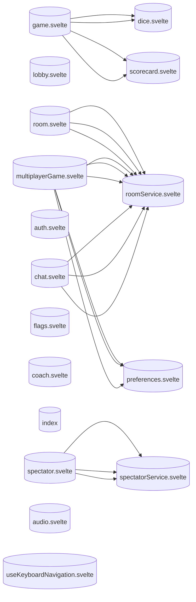

<!-- Auto-generated from AKG Graph. Edit source, not this file. -->
# Store Dependencies

> Auto-generated from AKG Graph
> Source: docs/architecture/akg/graph/current.json
> Commit: 7a8e61cecc43a3b3b21d6183cffb3ab79ca2a966
> Generated: 2025-12-12T03:12:20.958Z

## Store Dependency Diagram

Shows how Svelte stores depend on each other.

## Store List

- **game.svelte**: `packages/web/src/lib/stores/game.svelte.ts`
- **lobby.svelte**: `packages/web/src/lib/stores/lobby.svelte.ts`
- **room.svelte**: `packages/web/src/lib/stores/room.svelte.ts`
- **multiplayerGame.svelte**: `packages/web/src/lib/stores/multiplayerGame.svelte.ts`
- **scorecard.svelte**: `packages/web/src/lib/stores/scorecard.svelte.ts`
- **dice.svelte**: `packages/web/src/lib/stores/dice.svelte.ts`
- **auth.svelte**: `packages/web/src/lib/stores/auth.svelte.ts`
- **spectator.svelte**: `packages/web/src/lib/stores/spectator.svelte.ts`
- **flags.svelte**: `packages/web/src/lib/stores/flags.svelte.ts`
- **coach.svelte**: `packages/web/src/lib/stores/coach.svelte.ts`
- **index**: `packages/web/src/lib/stores/index.ts`
- **chat.svelte**: `packages/web/src/lib/stores/chat.svelte.ts`
- **audio.svelte**: `packages/web/src/lib/stores/audio.svelte.ts`
- **useKeyboardNavigation.svelte**: `packages/web/src/lib/hooks/useKeyboardNavigation.svelte.ts`
- **preferences.svelte**: `packages/web/src/lib/services/preferences.svelte.ts`
- **spectatorService.svelte**: `packages/web/src/lib/services/spectatorService.svelte.ts`
- **roomService.svelte**: `packages/web/src/lib/services/roomService.svelte.ts`
