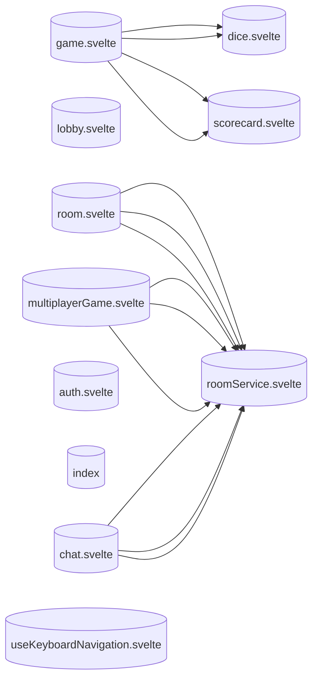

<!-- Auto-generated from AKG Graph. Edit source, not this file. -->
# Store Dependencies

> Auto-generated from AKG Graph
> Source: docs/architecture/akg/graph/current.json
> Commit: 10eb108e719d215041576d9d54d8f7e44a2e864a
> Generated: 2025-12-08T05:06:51.194Z

## Store Dependency Diagram

Shows how Svelte stores depend on each other.

## Store List

- **game.svelte**: `packages/web/src/lib/stores/game.svelte.ts`
- **lobby.svelte**: `packages/web/src/lib/stores/lobby.svelte.ts`
- **room.svelte**: `packages/web/src/lib/stores/room.svelte.ts`
- **multiplayerGame.svelte**: `packages/web/src/lib/stores/multiplayerGame.svelte.ts`
- **scorecard.svelte**: `packages/web/src/lib/stores/scorecard.svelte.ts`
- **dice.svelte**: `packages/web/src/lib/stores/dice.svelte.ts`
- **auth.svelte**: `packages/web/src/lib/stores/auth.svelte.ts`
- **index**: `packages/web/src/lib/stores/index.ts`
- **chat.svelte**: `packages/web/src/lib/stores/chat.svelte.ts`
- **useKeyboardNavigation.svelte**: `packages/web/src/lib/hooks/useKeyboardNavigation.svelte.ts`
- **roomService.svelte**: `packages/web/src/lib/services/roomService.svelte.ts`
