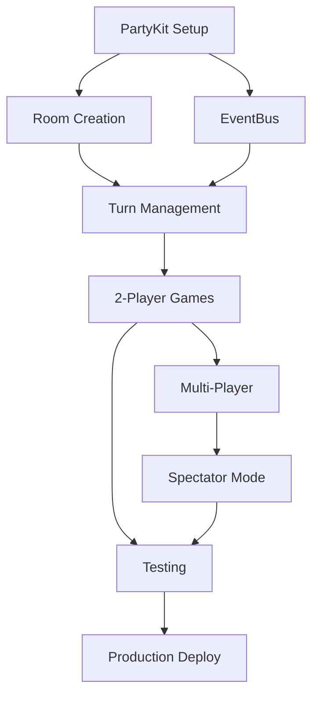

# Multiplayer Dicee - Project Management Plan
**Date**: November 30, 2025  
**Duration**: 4 weeks (80-100 hours)  
**Phase**: Pre-Implementation Planning

---

## Table of Contents

1. [Required Accounts & Services](#required-accounts--services)
2. [API/SDK Documentation Research](#apisdk-documentation-research)
3. [Compatibility Matrix](#compatibility-matrix)
4. [Development Environment Setup](#development-environment-setup)
5. [Team & Stakeholder Communication](#team--stakeholder-communication)
6. [Risk Assessment & Mitigation](#risk-assessment--mitigation)
7. [Budget & Cost Analysis](#budget--cost-analysis)
8. [Timeline & Milestones](#timeline--milestones)
9. [Success Metrics & KPIs](#success-metrics--kpis)
10. [Checklist for PM](#checklist-for-pm)

---

## Required Accounts & Services

### Essential Services (Required for MVP)

#### 1. PartyKit (Real-time Multiplayer)

**Purpose**: WebSocket coordination, game room hosting

**Account Setup**:
- [ ] Visit: https://www.partykit.io/
- [ ] Sign up with GitHub account (recommended)
- [ ] Note: Free tier includes:
  - Unlimited development
  - 100 GB bandwidth/month
  - 1M requests/month
  - Perfect for MVP testing

**What to do**:
```bash
# After account creation
npm install -g partykit

# Login
partykit login

# This creates ~/.partykit/config with auth token
```

**API Keys Needed**:
- ✅ Auto-generated on signup
- ✅ Stored in `~/.partykit/config`
- ✅ No manual API key management required

**Cost**: 
- Free tier: $0/month (sufficient for MVP)
- Pro tier: $10/month (if you exceed free limits)

**Documentation to Review**:
- Getting Started: https://docs.partykit.io/getting-started
- API Reference: https://docs.partykit.io/reference/partykit-server
- Examples: https://github.com/partykit/partykit/tree/main/examples

---

#### 2. GitHub (Version Control & CI/CD)

**Purpose**: Code hosting, GitHub Actions for CI/CD

**Account Setup**:
- [ ] Ensure you have a GitHub account
- [ ] Create repository: `your-username/dicee`
- [ ] Enable GitHub Actions (free for public repos)

**What to do**:
```bash
# If not already done
git init
git remote add origin https://github.com/your-username/dicee.git

# Enable GitHub Actions
# (Already done if using existing repo)
```

**API Keys Needed**:
- ✅ GitHub Personal Access Token (for CI/CD)
  - Settings → Developer Settings → Personal Access Tokens
  - Scopes: `repo`, `workflow`

**Cost**: Free (for public repos)

---

#### 3. Vercel or Netlify (Deployment)

**Purpose**: Frontend hosting, preview deployments

**Account Setup - Vercel** (Recommended):
- [ ] Visit: https://vercel.com/
- [ ] Sign up with GitHub account
- [ ] Connect to your GitHub repo
- [ ] Enable automatic deployments

**Account Setup - Netlify** (Alternative):
- [ ] Visit: https://www.netlify.com/
- [ ] Sign up with GitHub account
- [ ] Connect to your GitHub repo

**API Keys Needed**:
- ✅ Auto-configured via GitHub OAuth
- ✅ No manual API keys needed

**Cost**: Free tier (sufficient for MVP)

**What to Review**:
- Vercel Docs: https://vercel.com/docs
- Netlify Docs: https://docs.netlify.com/

---

### Optional Services (For v1.1+)

#### 4. Supabase (Cloud Profiles & Authentication)

**Purpose**: User profiles, cloud sync, social features

**When to Set Up**: Week 4 (after MVP works with localStorage)

**Account Setup**:
- [ ] Visit: https://supabase.com/
- [ ] Sign up with GitHub account
- [ ] Create new project: "dicee"
- [ ] Note your project URL and anon key

**API Keys Needed**:
```bash
# Add to .env
VITE_SUPABASE_URL=https://your-project.supabase.co
VITE_SUPABASE_ANON_KEY=your-anon-key
```

**Cost**: 
- Free tier: $0/month (500MB database, 50MB file storage)
- Pro tier: $25/month (if you need more)

**Documentation to Review**:
- Realtime: https://supabase.com/docs/guides/realtime
- Auth: https://supabase.com/docs/guides/auth
- Database: https://supabase.com/docs/guides/database

---

#### 5. Sentry (Error Tracking)

**Purpose**: Production error monitoring

**When to Set Up**: Week 4 (before production deployment)

**Account Setup**:
- [ ] Visit: https://sentry.io/
- [ ] Sign up (free tier available)
- [ ] Create project: "dicee"
- [ ] Get DSN key

**API Keys Needed**:
```bash
# Add to .env
VITE_SENTRY_DSN=https://xxx@xxx.ingest.sentry.io/xxx
```

**Cost**: Free tier (5K events/month)

---

#### 6. PostHog or Plausible (Analytics)

**Purpose**: User behavior analytics (privacy-friendly)

**When to Set Up**: Week 3-4 (optional)

**Account Setup - PostHog**:
- [ ] Visit: https://posthog.com/
- [ ] Sign up
- [ ] Get project API key

**Account Setup - Plausible** (Alternative):
- [ ] Visit: https://plausible.io/
- [ ] Sign up ($9/month, but privacy-focused)

**Cost**: 
- PostHog: Free tier (1M events/month)
- Plausible: $9/month

---

## API/SDK Documentation Research

### Priority 1: Must Read Before Starting

#### PartyKit Documentation (Estimated: 3-4 hours)

**Core Concepts to Understand**:
- [ ] **Rooms & Parties** - What's a Party? Room lifecycle
  - Read: https://docs.partykit.io/concepts/rooms-and-parties
  - Time: 30 minutes

- [ ] **Connections** - Managing player connections
  - Read: https://docs.partykit.io/concepts/connections
  - Time: 30 minutes

- [ ] **Durable Objects** - PartyKit's underlying tech
  - Read: https://docs.partykit.io/concepts/durable-objects
  - Time: 20 minutes

- [ ] **Deployment** - How to deploy PartyKit servers
  - Read: https://docs.partykit.io/guides/deploying-your-partykit-server
  - Time: 20 minutes

**Practical Tutorials**:
- [ ] **Hello World Example**
  - Tutorial: https://docs.partykit.io/getting-started
  - Build: Simple chat room
  - Time: 1 hour
  - Why: Understand basic PartyKit patterns

- [ ] **Multiplayer Cursor Example**
  - Code: https://github.com/partykit/partykit/tree/main/examples/multiplayer-cursor
  - Why: Similar to our turn indicator needs
  - Time: 30 minutes

**API Reference**:
- [ ] **PartyServer API**
  - Docs: https://docs.partykit.io/reference/partykit-server
  - Focus on:
    - `onConnect(conn, ctx)` - Player joins
    - `onMessage(message, sender)` - Player action
    - `onClose(conn)` - Player leaves
    - `room.broadcast(message)` - Send to all
  - Time: 45 minutes

- [ ] **PartySocket Client API**
  - Docs: https://docs.partykit.io/reference/partysocket-client
  - Focus on:
    - Connection management
    - Reconnection strategies
    - Error handling
  - Time: 30 minutes

**Total Time**: 4 hours

---

#### XState v5 Documentation (Estimated: 4-5 hours)

**Why XState**: Deterministic turn management, visualizable state machines

**Core Concepts**:
- [ ] **State Machines 101**
  - Read: https://stately.ai/docs/state-machines-and-statecharts
  - Why: Fundamental understanding
  - Time: 30 minutes

- [ ] **XState v5 Basics**
  - Read: https://stately.ai/docs/xstate
  - Focus on:
    - `setup()` and `createMachine()`
    - States and transitions
    - Actions (entry/exit)
    - Guards (conditions)
  - Time: 1 hour

- [ ] **Context & Events**
  - Read: https://stately.ai/docs/context
  - Why: Managing game state in the machine
  - Time: 45 minutes

**Practical Tutorials**:
- [ ] **Traffic Light Example**
  - Tutorial: https://stately.ai/docs/tutorials/traffic-light
  - Why: Simple state transitions
  - Time: 45 minutes

- [ ] **Game State Example**
  - Tutorial: https://stately.ai/docs/examples
  - Look for: Turn-based game examples
  - Time: 1 hour

**Visualizer** (Critical Tool):
- [ ] **Stately Viz**
  - URL: https://stately.ai/viz
  - Why: Visualize your state machine as you build
  - Practice: Draw out Dicee turn flow
  - Time: 30 minutes

**Total Time**: 4.5 hours

---

### Priority 2: Reference Documentation

#### Svelte 5 (Runes)

**What to Review**:
- [ ] **$state rune** - Reactive state
  - Docs: https://svelte.dev/docs/svelte/$state
  - Time: 15 minutes

- [ ] **$effect rune** - Side effects
  - Docs: https://svelte.dev/docs/svelte/$effect
  - Time: 15 minutes

- [ ] **$derived rune** - Computed values
  - Docs: https://svelte.dev/docs/svelte/$derived
  - Time: 15 minutes

**Why**: Core to our reactive multiplayer state

**Total Time**: 45 minutes

---

#### SvelteKit (If not already familiar)

**What to Review**:
- [ ] **Load Functions** - Data loading
  - Docs: https://kit.svelte.dev/docs/load
  - Time: 20 minutes

- [ ] **Environment Variables**
  - Docs: https://kit.svelte.dev/docs/modules#$env-static-public
  - Why: PartyKit host, API keys
  - Time: 10 minutes

**Total Time**: 30 minutes

---

### Priority 3: Optional Deep Dives

#### Event Sourcing Pattern

**What to Review**:
- [ ] **Martin Fowler's Event Sourcing**
  - Article: https://martinfowler.com/eaaDev/EventSourcing.html
  - Why: Understand the pattern we're using
  - Time: 30 minutes

- [ ] **CQRS Pattern**
  - Article: https://martinfowler.com/bliki/CQRS.html
  - Why: Command/Query separation in our events
  - Time: 20 minutes

**Total Time**: 50 minutes

---

#### CRDT (Conflict-Free Replicated Data Types)

**What to Review**:
- [ ] **CRDT Explained**
  - Article: https://crdt.tech/
  - Why: Our "CRDT-lite" approach for optimistic updates
  - Time: 30 minutes (optional)

---

### Documentation Time Budget Summary

| Priority | Topic | Time |
|----------|-------|------|
| 🔴 P1 | PartyKit | 4 hours |
| 🔴 P1 | XState v5 | 4.5 hours |
| 🟡 P2 | Svelte 5 Runes | 45 minutes |
| 🟡 P2 | SvelteKit | 30 minutes |
| 🟢 P3 | Event Sourcing | 50 minutes |
| **Total** | | **10.5 hours** |

**Recommendation**: Budget 2 full work days (16 hours) for documentation review and experimentation.

---

## Compatibility Matrix

### Browser Compatibility

#### Target Support Matrix

| Browser | Minimum Version | WebSocket Support | IndexedDB | localStorage | Notes |
|---------|----------------|-------------------|-----------|--------------|-------|
| **Chrome** | 90+ | ✅ | ✅ | ✅ | Primary target |
| **Edge** | 90+ | ✅ | ✅ | ✅ | Chromium-based |
| **Firefox** | 88+ | ✅ | ✅ | ✅ | Fully supported |
| **Safari** | 14+ | ✅ | ✅ | ✅ | iOS 14+ |
| **Safari iOS** | 14+ | ✅ | ✅ | ✅ | Mobile primary |
| **Chrome Android** | 90+ | ✅ | ✅ | ✅ | Mobile primary |

**Required Features**:
- ✅ **WebSocket** - For PartyKit real-time sync
- ✅ **localStorage** - For user profiles (MVP)
- ✅ **IndexedDB** - For game history (optional)
- ✅ **ES2020** - For modern JavaScript features

**Testing Strategy**:
```bash
# BrowserStack account (optional, for testing)
# Free for open source: https://www.browserstack.com/open-source

# Or use Playwright (already in project)
pnpm playwright test --project="Mobile Safari"
```

---

### Device Compatibility

#### Supported Devices

| Device Type | Screen Size | Touch Support | Notes |
|-------------|-------------|---------------|-------|
| **Desktop** | 1024px+ | Mouse | Primary dev environment |
| **Laptop** | 1280x720+ | Mouse/Trackpad | Common use case |
| **Tablet** | 768-1024px | Touch | iPad, Android tablets |
| **Large Phone** | 393-428px | Touch | iPhone 14 Pro, Pixel 7 |
| **Small Phone** | 375px | Touch | iPhone SE (minimum) |

**Multiplayer UI Considerations**:
- Turn indicator must be visible on all screen sizes
- Player list: Stack on mobile, sidebar on desktop
- Dice tray: 5 dice must fit on smallest screen
- Room code: Large, easy to read/share

---

### Network Compatibility

#### Connection Requirements

| Scenario | Min Bandwidth | Latency | Notes |
|----------|---------------|---------|-------|
| **Single Player** | 1 Mbps | <500ms | WASM + assets |
| **Multiplayer (2-4)** | 1 Mbps | <200ms | WebSocket events |
| **Spectator** | 500 Kbps | <300ms | Read-only sync |

**Fallback Strategies**:
```typescript
// Detect slow connection
if (navigator.connection?.downlink < 1) {
  // Reduce animation quality
  // Increase sync interval
  // Show "slow connection" warning
}
```

---

### Technology Version Compatibility

#### Node.js & Package Managers

| Tool | Minimum | Recommended | Notes |
|------|---------|-------------|-------|
| **Node.js** | 18.0.0 | 20.11.0 | LTS version |
| **pnpm** | 8.0.0 | 8.15.0 | Workspace support |
| **TypeScript** | 5.0.0 | 5.3.0 | Latest stable |
| **Vite** | 5.0.0 | 5.1.0 | Current in project |

**Verification Script**:
```bash
# Check versions
node --version    # Should be v20.x
pnpm --version    # Should be 8.x
tsc --version     # Should be 5.x

# If outdated
nvm install 20    # Use Node 20
npm install -g pnpm@8
```

---

#### Key Dependencies

| Package | Version | Purpose | Breaking Changes |
|---------|---------|---------|------------------|
| **partykit** | ^0.0.x | Real-time server | Beta, expect changes |
| **partysocket** | ^0.0.x | Client library | Beta, API may change |
| **xstate** | ^5.0.0 | State machines | v5 is stable |
| **svelte** | ^5.0.0 | Framework | Runes are stable |
| **@sveltejs/kit** | ^2.0.0 | Meta-framework | Stable |

**Version Pinning Strategy**:
```json
// package.json
{
  "dependencies": {
    "partykit": "0.0.111",     // Pin exact (beta)
    "xstate": "^5.9.0"          // Allow patch updates
  }
}
```

---

### Third-Party Service Compatibility

#### PartyKit

**Platform Requirements**:
- ✅ **Cloudflare Workers** - PartyKit runs on Cloudflare
- ✅ **Durable Objects** - Underlying storage
- ✅ **WebSocket** - Protocol supported

**Limitations**:
- Max 1MB message size
- Max 1000 concurrent connections per room (more than enough)
- 10 second CPU time limit per request

**Regional Availability**:
- Global edge network (Cloudflare)
- Auto-routing to nearest region
- No manual region selection needed

---

#### Vercel/Netlify

**Compatibility**:
- ✅ **SvelteKit** - First-class support
- ✅ **Vite** - Native support
- ✅ **Environment Variables** - Supported
- ✅ **Preview Deployments** - Automatic

**Deployment Constraints**:
- Vercel: 100GB bandwidth/month (free)
- Netlify: 100GB bandwidth/month (free)
- Both: Unlimited sites on free tier

---

## Development Environment Setup

### Required Software

#### Core Tools

| Tool | Installation | Purpose |
|------|--------------|---------|
| **Node.js 20 LTS** | https://nodejs.org/ or `nvm install 20` | Runtime |
| **pnpm 8.x** | `npm install -g pnpm@8` | Package manager |
| **Git** | https://git-scm.com/ | Version control |
| **VS Code** | https://code.visualstudio.com/ | Editor (recommended) |

#### VS Code Extensions (Recommended)

**Essential**:
- [ ] **Svelte for VS Code** (`svelte.svelte-vscode`)
  - Syntax highlighting, IntelliSense
  
- [ ] **Prettier** (`esbenp.prettier-vscode`)
  - Code formatting
  
- [ ] **ESLint** (`dbaeumer.vscode-eslint`)
  - Linting

**Helpful for Multiplayer**:
- [ ] **Error Lens** (`usernamehw.errorlens`)
  - Inline error display
  
- [ ] **Thunder Client** (`rangav.vscode-thunder-client`)
  - API testing (for PartyKit endpoints)
  
- [ ] **WebSocket King** (`felixfbecker.websocket-king`)
  - Test WebSocket connections

---

### Environment Variables Setup

**Create `.env` file** in `packages/web/`:

```bash
# PartyKit
VITE_PARTYKIT_HOST=localhost:1999  # Dev
# VITE_PARTYKIT_HOST=your-app.partykit.io  # Production

# Supabase (v1.1, optional)
# VITE_SUPABASE_URL=https://your-project.supabase.co
# VITE_SUPABASE_ANON_KEY=your-anon-key

# Sentry (Week 4, optional)
# VITE_SENTRY_DSN=https://xxx@xxx.ingest.sentry.io/xxx

# Feature Flags (optional)
VITE_ENABLE_MULTIPLAYER=true
VITE_ENABLE_SPECTATOR=false  # Enable in Week 3
```

**Add to `.gitignore`**:
```
.env
.env.local
.env.*.local
```

**Add `.env.example`** for team:
```bash
# PartyKit
VITE_PARTYKIT_HOST=localhost:1999

# Add your other env vars here with placeholder values
```

---

### Testing Environment

**Multiplayer Testing Requirements**:

1. **Multiple Browser Windows**
   - Open 2-4 browser windows for local testing
   - Use different browsers (Chrome + Firefox)
   - Use incognito mode for separate sessions

2. **Mobile Testing**
   - Use existing mobile testing setup (from earlier)
   - Test multiplayer on phone + desktop simultaneously

3. **Network Simulation**
   - Chrome DevTools → Network → Throttling
   - Test "Slow 3G" for edge cases

**Test Account Setup**:
```bash
# Create test profiles in localStorage
# Player 1: localhost:5173
# Player 2: localhost:5173 (incognito)
# Player 3: Mobile device

# Each gets auto-generated profile on first visit
```

---

## Team & Stakeholder Communication

### Communication Plan

#### Weekly Sync (Recommended)

**Week 1: Foundation**
- **Topics**: PartyKit setup, profile system, visual feedback
- **Demo**: Enhanced dice roll, profile creation
- **Blockers**: PartyKit deployment issues?

**Week 2: Core Multiplayer**
- **Topics**: Room creation, turn management
- **Demo**: 2-player game working end-to-end
- **Blockers**: State sync issues?

**Week 3: Scale & Spectate**
- **Topics**: 3-4 players, spectator mode
- **Demo**: Full multiplayer game with spectators
- **Blockers**: Performance issues?

**Week 4: Polish & Deploy**
- **Topics**: Testing, security, deployment
- **Demo**: Production-ready multiplayer
- **Blockers**: Any last-minute issues?

---

#### Stakeholder Updates

**Recommended Format**:

```markdown
## Dicee Multiplayer - Week X Update

### ✅ Completed
- Task 1 (estimated: 4h, actual: 5h)
- Task 2 (estimated: 6h, actual: 6h)

### 🚧 In Progress
- Task 3 (50% complete, on track)

### 🚨 Blockers
- None / [Describe blocker]

### 📊 Metrics
- Test coverage: 75% → 78%
- Bundle size: 450KB → 465KB (+15KB for PartyKit)
- Performance: All targets met

### 🎯 Next Week
- Focus: [Main goal]
- Risk: [Any concerns]
```

---

### Documentation During Development

**Required Artifacts**:

1. **ADRs (Architecture Decision Records)**
   - Why PartyKit over alternatives?
   - Why XState for turn management?
   - Why localStorage first, Supabase later?

2. **API Documentation**
   - PartyKit server endpoints
   - Event types and payloads
   - WebSocket message format

3. **Runbook**
   - How to deploy
   - How to roll back
   - How to debug production issues

**Templates Available**: See ADR template in project docs

---

## Risk Assessment & Mitigation

### Technical Risks

#### Risk 1: PartyKit Beta Instability

**Probability**: Medium (30%)  
**Impact**: High (could block development)

**Indicators**:
- API changes breaking our code
- Deployment failures
- Unexpected downtime

**Mitigation**:
- Pin exact PartyKit version (no `^` in package.json)
- Follow PartyKit Discord for announcements
- Have fallback: Supabase Realtime (heavier but stable)
- Test early (Week 1) to catch issues

**Contingency Plan**:
```typescript
// Abstraction layer for real-time service
interface RealtimeService {
  connect(roomId: string): Promise<void>;
  send(event: GameEvent): void;
  onEvent(handler: (event: GameEvent) => void): void;
}

// Swap implementation if needed
const realtimeService: RealtimeService = 
  USE_PARTYKIT ? new PartyKitService() : new SupabaseService();
```

---

#### Risk 2: State Synchronization Bugs

**Probability**: High (60%)  
**Impact**: Medium (annoying but fixable)

**Indicators**:
- Players see different game states
- Dice rolls not showing for all players
- Scores desync

**Mitigation**:
- Server is source of truth (not client)
- Full state sync every 30 seconds
- Event sourcing enables replay/debug
- Comprehensive integration tests

**Debug Strategy**:
```typescript
// Enable debug logging
localStorage.setItem('dicee:debug', 'true');

// Log all events
eventBus.on('*', (event) => {
  console.log('[EVENT]', event);
});

// Compare client vs server state
function auditState() {
  const clientState = gameRoomState.value;
  const serverState = await syncService.requestStateSync();
  
  if (!deepEqual(clientState, serverState)) {
    console.error('STATE MISMATCH', { clientState, serverState });
    // Auto-resolve: Use server state
    gameRoomState.value = serverState;
  }
}
```

---

#### Risk 3: Performance Degradation

**Probability**: Low (20%)  
**Impact**: Medium

**Indicators**:
- Slow UI updates (>100ms)
- High memory usage
- Battery drain on mobile

**Mitigation**:
- Performance budgets in CI
- Lighthouse audits (weekly)
- Bundle size monitoring
- Lazy load multiplayer code

**Performance Budget**:
```json
// .lighthouserc.json
{
  "ci": {
    "assert": {
      "assertions": {
        "first-contentful-paint": ["error", { "maxNumericValue": 1500 }],
        "interactive": ["error", { "maxNumericValue": 3000 }],
        "total-byte-weight": ["error", { "maxNumericValue": 512000 }]
      }
    }
  }
}
```

---

### Schedule Risks

#### Risk 4: Scope Creep

**Probability**: Medium (40%)  
**Impact**: High (delays MVP)

**Indicators**:
- "Wouldn't it be cool if..."
- Adding features not in Phase 1-4
- Perfectionism delaying launch

**Mitigation**:
- **Strict MVP scope** (see architecture doc)
- Feature flags for experimental features
- "v1.1 backlog" for good ideas
- Time-box each week

**v1.1 Backlog** (Don't build in MVP):
- ❌ AI opponent
- ❌ Tournament mode
- ❌ Leaderboards
- ❌ Custom game rules
- ❌ Voice chat
- ❌ Emotes/reactions

---

#### Risk 5: Learning Curve

**Probability**: Medium (40%)  
**Impact**: Medium

**Indicators**:
- Spending >2 days on PartyKit basics
- XState confusion
- Event sourcing complexity

**Mitigation**:
- **10.5 hour** documentation budget (see above)
- Build "Hello World" PartyKit app first (Week 1, Day 1)
- Use XState visualizer extensively
- Ask for help early (PartyKit Discord, XState GitHub)

---

### External Dependencies Risks

#### Risk 6: PartyKit Service Outage

**Probability**: Low (10%)  
**Impact**: High

**Mitigation**:
- Monitor PartyKit status page
- Have "offline mode" fallback
- Clear error messages to users
- Auto-retry with exponential backoff

**Status Monitoring**:
- PartyKit status: https://status.partykit.io/ (if exists)
- Set up uptime monitoring (UptimeRobot, free)

---

## Budget & Cost Analysis

### Development Costs

**Time Investment**:
| Phase | Hours | Rate ($100/hr) | Cost |
|-------|-------|----------------|------|
| Planning | 10 | $100 | $1,000 |
| Week 1 | 22 | $100 | $2,200 |
| Week 2 | 27 | $100 | $2,700 |
| Week 3 | 22 | $100 | $2,200 |
| Week 4 | 17 | $100 | $1,700 |
| **Total** | **98** | | **$9,800** |

*(Adjust rate based on your actual development cost)*

---

### Service Costs (Monthly)

#### MVP (Months 1-3)

| Service | Free Tier | Likely Usage | Cost |
|---------|-----------|--------------|------|
| **PartyKit** | 100GB bandwidth, 1M requests | <10GB, <100K | $0 |
| **Vercel** | 100GB bandwidth | <20GB | $0 |
| **GitHub** | Unlimited public repos | 1 repo | $0 |
| **Supabase** | Not used in MVP | N/A | $0 |
| **Sentry** | 5K events/month | <1K | $0 |
| **Total** | | | **$0/month** |

---

#### Production (Months 4+)

**Assumptions**:
- 1,000 daily active users
- 50 concurrent games
- 100 games/day

| Service | Free Tier | Expected Usage | Cost |
|---------|-----------|----------------|------|
| **PartyKit** | 100GB | ~50GB | $0 (still free) |
| **Vercel** | 100GB | ~30GB | $0 |
| **Supabase** | 500MB DB | ~200MB | $0 |
| **Sentry** | 5K events | ~3K | $0 |
| **Analytics** | Optional | N/A | $0-9 |
| **Total** | | | **$0-9/month** |

**Cost Triggers** (When to upgrade):
- PartyKit: >100GB bandwidth → $10/month
- Vercel: >100GB bandwidth → $20/month
- Supabase: >500MB database → $25/month

**Expected Burn Rate**: $0/month for first 6 months (assuming <5K users)

---

### Infrastructure Costs Summary

**Total 4-Week Development**:
- Development time: $9,800 (98 hours @ $100/hr)
- Service costs: $0 (all free tiers)
- **Total**: $9,800

**Ongoing Monthly Costs**:
- MVP phase (Months 1-3): $0/month
- Production (Months 4+): $0-20/month
- At scale (>10K users): $50-100/month

---

## Timeline & Milestones

### Week-by-Week Breakdown

#### Week 1: Foundation (Dec 2-8, 2025)

**Milestone**: Visual feedback + profiles + PartyKit connected

| Day | Tasks | Hours | Status |
|-----|-------|-------|--------|
| Mon | Read PartyKit docs, setup account | 4 | ⬜ |
| Tue | Enhanced dice animation, sound effects | 4 | ⬜ |
| Wed | Profile service (localStorage) | 4 | ⬜ |
| Thu | Profile UI (creation wizard) | 4 | ⬜ |
| Fri | PartyKit "Hello World", EventBus | 4 | ⬜ |

**Deliverable**: 
- ✅ Visual feedback polished
- ✅ Profiles created and persisted
- ✅ PartyKit test room working

---

#### Week 2: Core Multiplayer (Dec 9-15, 2025)

**Milestone**: 2-player games work end-to-end

| Day | Tasks | Hours | Status |
|-----|-------|-------|--------|
| Mon | Game room creation, joining | 5 | ⬜ |
| Tue | Room lobby UI | 5 | ⬜ |
| Wed | XState turn machine | 5 | ⬜ |
| Thu | Real-time sync service | 6 | ⬜ |
| Fri | 2-player integration testing | 6 | ⬜ |

**Deliverable**:
- ✅ Can create room, share code
- ✅ 2 players join and play complete game
- ✅ Turns alternate correctly
- ✅ Winner determined

---

#### Week 3: Scale & Spectate (Dec 16-22, 2025)

**Milestone**: 3-4 players, spectators, statistics

| Day | Tasks | Hours | Status |
|-----|-------|-------|--------|
| Mon | 3-4 player support | 4 | ⬜ |
| Tue | Player order UI, turn indicator | 4 | ⬜ |
| Wed | Spectator mode | 5 | ⬜ |
| Thu | Game statistics, recap screen | 4 | ⬜ |
| Fri | UI polish, animations | 5 | ⬜ |

**Deliverable**:
- ✅ 4-player games work
- ✅ Spectators can watch
- ✅ Rich statistics displayed
- ✅ Polished UI

---

#### Week 4: Testing & Deployment (Dec 23-29, 2025)

**Milestone**: Production-ready multiplayer

| Day | Tasks | Hours | Status |
|-----|-------|-------|--------|
| Mon | Integration test suite | 5 | ⬜ |
| Tue | Security audit, input validation | 4 | ⬜ |
| Wed | Performance optimization | 3 | ⬜ |
| Thu | Deploy to production (Vercel + PartyKit) | 3 | ⬜ |
| Fri | Documentation, runbook | 2 | ⬜ |

**Deliverable**:
- ✅ 80%+ test coverage
- ✅ Security validated
- ✅ Performance benchmarks met
- ✅ Live in production

---

### Critical Path

**Blockers** (Tasks that block other work):

```
Week 1, Day 1: PartyKit account setup
    ↓
Week 1, Day 5: PartyKit "Hello World" working
    ↓
Week 2, Day 1: Room creation
    ↓
Week 2, Day 3: Turn management
    ↓
Week 2, Day 5: 2-player working
    ↓
Week 3, Day 1: Multi-player
    ↓
Week 4, Day 4: Production deployment
```

**If any blocker fails, entire timeline slips.**

---

### Dependency Chain



---

## Success Metrics & KPIs

### Technical Metrics

#### Performance

| Metric | Target | Measurement |
|--------|--------|-------------|
| **WebSocket Latency** | <50ms | `ping/pong` round trip |
| **State Sync Time** | <100ms | Event → UI update |
| **Bundle Size** | <50KB | Multiplayer code only |
| **Memory Usage** | <100MB | Chrome DevTools |
| **CPU Usage** | <5% | During active game |

**Measurement Tools**:
```bash
# Bundle size
pnpm build
du -h .svelte-kit/output/client/_app/*.js

# Performance
# Use Lighthouse, Chrome DevTools Performance tab
```

---

#### Quality

| Metric | Target | Measurement |
|--------|--------|-------------|
| **Test Coverage** | >80% | Vitest coverage report |
| **Bug Density** | <2 bugs/KLOC | Issue tracker |
| **Code Review** | 100% PRs reviewed | GitHub |
| **Linter Errors** | 0 | CI checks |

---

### Product Metrics

#### User Engagement (Week 4+)

| Metric | Target | Measurement |
|--------|--------|-------------|
| **Games Created** | 50/day | Analytics |
| **Games Completed** | 40/day (80%) | Analytics |
| **Average Game Duration** | 10-15 minutes | Event log |
| **Return Rate** | >30% daily | Analytics |

---

#### Multiplayer-Specific

| Metric | Target | Measurement |
|--------|--------|-------------|
| **Avg Players/Game** | 2-3 | Room data |
| **Room Abandonment** | <20% | Event: `game.abandoned` |
| **Spectators/Game** | >0.5 | Room data |
| **Desync Events** | <1% of games | Error logs |

---

### Business Metrics (Optional)

| Metric | Target | Notes |
|--------|--------|-------|
| **User Acquisition Cost** | $0 (organic) | MVP phase |
| **Hosting Costs** | <$20/month | Free tiers |
| **Development Cost** | ~$10K | 100 hours |
| **Time to Market** | 4 weeks | Critical |

---

## Checklist for PM

### Pre-Implementation (Week 0)

**Accounts & Access**:
- [ ] PartyKit account created and logged in
- [ ] GitHub repository set up with Actions enabled
- [ ] Vercel/Netlify account connected to repo
- [ ] Supabase account created (optional, for v1.1)
- [ ] Sentry account created (optional, for Week 4)

**Documentation Research**:
- [ ] PartyKit docs reviewed (~4 hours)
- [ ] XState v5 docs reviewed (~4.5 hours)
- [ ] Svelte 5 runes refresher (~45 minutes)
- [ ] Event sourcing pattern understood (~50 minutes)
- [ ] Total: ~10 hours budgeted and completed

**Environment Setup**:
- [ ] Node.js 20 installed
- [ ] pnpm 8 installed
- [ ] VS Code with recommended extensions
- [ ] `.env` file created with PartyKit host
- [ ] Multiple browser windows for testing

**Team Communication**:
- [ ] Weekly sync scheduled (if applicable)
- [ ] Stakeholder update format agreed upon
- [ ] ADR template reviewed
- [ ] Documentation plan in place

**Risk Management**:
- [ ] Risk register reviewed
- [ ] Mitigation strategies understood
- [ ] Contingency plans documented
- [ ] Monitoring setup (uptime, errors)

**Budget**:
- [ ] Development cost estimated (~$10K @ $100/hr)
- [ ] Service costs reviewed (expect $0/month MVP)
- [ ] Cost triggers identified (when to upgrade tiers)

---

### Week 1 Checkpoint

**Completed**:
- [ ] Enhanced dice animation working
- [ ] User profiles created and persisted
- [ ] PartyKit "Hello World" deployed
- [ ] EventBus implemented and tested

**Metrics Check**:
- [ ] Test coverage: >70%
- [ ] No linter errors
- [ ] Bundle size: <500KB (base)
- [ ] All Week 1 tasks in "Done" column

**Risks Review**:
- [ ] Any blockers encountered?
- [ ] PartyKit stable and working?
- [ ] Schedule still on track?

---

### Week 2 Checkpoint

**Completed**:
- [ ] Room creation/joining working
- [ ] XState turn machine implemented
- [ ] 2-player game works end-to-end
- [ ] Real-time sync operational

**Metrics Check**:
- [ ] Test coverage: >75%
- [ ] WebSocket latency: <50ms
- [ ] State sync: <100ms
- [ ] Zero desync events in testing

**Demo**:
- [ ] Can create room, share code
- [ ] 2 players can join and play
- [ ] Winner correctly determined
- [ ] Game state syncs properly

---

### Week 3 Checkpoint

**Completed**:
- [ ] 3-4 player support working
- [ ] Spectator mode functional
- [ ] Game statistics implemented
- [ ] UI polished

**Metrics Check**:
- [ ] Test coverage: >80%
- [ ] 4-player game tested successfully
- [ ] Spectator view tested
- [ ] Performance targets met

**User Testing**:
- [ ] Friends/colleagues tested multiplayer
- [ ] Feedback collected
- [ ] Critical bugs fixed

---

### Week 4 Checkpoint (Final)

**Completed**:
- [ ] Integration tests passing
- [ ] Security audit complete
- [ ] Performance optimized
- [ ] Production deployment successful
- [ ] Documentation complete

**Metrics Check**:
- [ ] All technical targets met (see above)
- [ ] Test coverage: >80%
- [ ] Lighthouse score: >90
- [ ] Zero critical bugs

**Production Readiness**:
- [ ] Monitoring in place (Sentry)
- [ ] Error tracking configured
- [ ] Runbook documented
- [ ] Rollback plan tested

**Launch**:
- [ ] Announcement prepared
- [ ] Support plan ready
- [ ] Analytics tracking
- [ ] Post-launch monitoring plan

---

### Post-Launch (Week 5+)

**Ongoing Monitoring**:
- [ ] Daily active users tracked
- [ ] Error rate monitored
- [ ] Performance metrics reviewed
- [ ] User feedback collected

**Maintenance**:
- [ ] Bug fixes prioritized
- [ ] Performance improvements
- [ ] Feature requests triaged
- [ ] v1.1 planning begins

---

## Appendix: Quick Reference

### Important Links

**Services**:
- PartyKit: https://www.partykit.io/
- Vercel: https://vercel.com/
- Supabase: https://supabase.com/
- Sentry: https://sentry.io/

**Documentation**:
- PartyKit Docs: https://docs.partykit.io/
- XState Docs: https://stately.ai/docs/xstate
- Svelte 5: https://svelte.dev/docs/svelte/overview
- SvelteKit: https://kit.svelte.dev/docs

**Tools**:
- XState Visualizer: https://stately.ai/viz
- PartyKit Status: https://status.partykit.io/
- BrowserStack: https://www.browserstack.com/

---

### Key Commands

```bash
# PartyKit
partykit login
partykit dev             # Start dev server
partykit deploy         # Deploy to production

# Development
pnpm dev                # Start local dev
pnpm dev:mobile         # Mobile testing
pnpm test               # Run tests
pnpm test:e2e           # E2E tests

# Deployment
vercel --prod           # Deploy to production
git push origin main    # Trigger CI/CD

# Debugging
pnpm build              # Check bundle size
pnpm test:coverage      # Coverage report
lighthouse http://localhost:5173  # Performance audit
```

---

### Contact Information

**PartyKit Support**:
- Discord: https://discord.gg/partykit
- GitHub: https://github.com/partykit/partykit/issues

**Community**:
- Svelte Discord: https://svelte.dev/chat
- SvelteKit Discord: https://discord.com/invite/svelte

---

**Total Estimated Time**: 98 hours over 4 weeks  
**Total Estimated Cost**: ~$10K development + $0/month services (MVP)  
**Risk Level**: Medium (new tech, network complexity)  
**Confidence**: High (modern stack, proven patterns)

---

**Ready to start? Begin with the Pre-Implementation checklist above!** ✅
