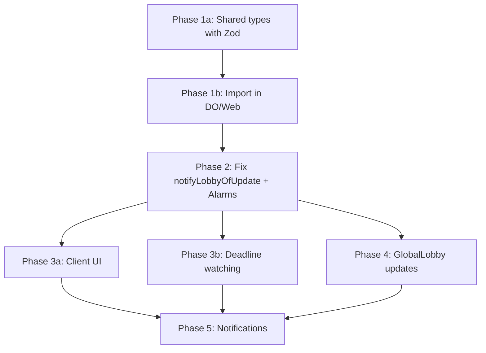

# Connection UX Implementation Plan

> **Version**: 2.0 (Revised with Expert Feedback)  
> **Last Updated**: 2025-12-31  
> **Status**: Ready for Implementation

## Executive Summary

This document outlines the implementation plan for improving the game session and reconnection UX based on the patterns in `/connection-ux-planning.md`. The core issue is that the lobby currently only shows connected players, causing "Join" to appear instead of "Rejoin" for disconnected players who still have reserved seats.

**Core Problem**: When a player disconnects, `notifyLobbyOfUpdate()` builds the player list from `getWebSockets()`, which only includes currently connected sockets. Disconnected players with reserved seats are not included, breaking the rejoin UX.

---

## Current State Analysis

### Architecture Overview

```
┌─────────────────┐     RPC      ┌─────────────────┐
│    GameRoom     │─────────────▶│   GlobalLobby   │
│   Durable Object│              │  Durable Object │
├─────────────────┤              ├─────────────────┤
│ • PlayerSeats   │              │ • RoomDirectory │
│ • RoomState     │              │ • UserPresence  │
│ • GameState     │              │                 │
└─────────────────┘              └─────────────────┘
         │                                │
         │ WebSocket                      │ WebSocket
         ▼                                ▼
┌─────────────────┐              ┌─────────────────┐
│   Game Client   │              │  Lobby Client   │
│  (room.svelte)  │              │ (lobby.svelte)  │
└─────────────────┘              └─────────────────┘
```

### Key Files Analyzed

| File | Purpose | Key Findings |
|------|---------|--------------|
| `GameRoom.ts:1032-1088` | `notifyLobbyOfUpdate()` | **BUG**: Uses `getWebSockets()` for player list - excludes disconnected players |
| `GameRoom.ts:804-938` | Seat management | `getSeats()` returns all seats including disconnected players with `isConnected`, `reconnectDeadline` |
| `types.ts:88-115` | `PlayerSeat` interface | Has `isConnected`, `disconnectedAt`, `reconnectDeadline` fields - already tracks presence! |
| `types.ts:313-319` | `PlayerSummary` interface | **MISSING**: No presence state field |
| `room-directory.ts:31-55` | `RoomInfo` interface | **MISSING**: Players don't have presence state |
| `RoomCartridge.svelte:71` | `isExistingPlayer` | Checks `room.players.some(p => p.userId === auth.userId)` |

### The Root Cause

```typescript
// GameRoom.ts:1042-1053 - THE BUG
// Only iterates connected WebSockets, not persisted seats
for (const ws of this.ctx.getWebSockets(`player:${roomCode}`)) {
    const state = ws.deserializeAttachment() as ConnectionState;
    players.push({ ... });
}
```

When a player disconnects:
1. Their WebSocket closes and is removed from `getWebSockets()`
2. Their `PlayerSeat` still exists in storage with `isConnected: false`
3. `notifyLobbyOfUpdate()` doesn't include them in `players` array
4. Lobby RoomInfo has no record of them
5. Client shows "Join" instead of "Rejoin"

---

## Implementation Plan

### Phase 1a: Shared Types with Zod Schemas (Source of Truth)

**Goal**: Define all lobby/presence types ONCE in the shared package with Zod schemas.

> ⚠️ **CRITICAL**: This prevents type drift. All packages import from here.

#### 1a.1 Create Shared Lobby Types

```typescript
// packages/shared/src/types/lobby.ts

import { z } from 'zod/v4';

// =============================================================================
// Player Presence State
// =============================================================================

/**
 * Player presence state in a room:
 * - connected: Actively connected via WebSocket
 * - disconnected: Socket closed but seat reserved (within grace period)
 * - abandoned: Grace period expired, slot can be reclaimed
 */
export const PlayerPresenceStateSchema = z.enum([
  'connected',
  'disconnected',
  'abandoned',
]);
export type PlayerPresenceState = z.infer<typeof PlayerPresenceStateSchema>;

// =============================================================================
// Player Summary (for lobby display)
// =============================================================================

export const PlayerSummarySchema = z.object({
  userId: z.string().uuid(),
  displayName: z.string(),
  avatarSeed: z.string(),
  score: z.number().int().nonnegative(),
  isHost: z.boolean(),
  // Presence fields
  presenceState: PlayerPresenceStateSchema,
  reconnectDeadline: z.number().nullable(), // Epoch ms, null if connected or abandoned
  lastSeenAt: z.number().nullable(),        // Epoch ms, null if connected
});
export type PlayerSummary = z.infer<typeof PlayerSummarySchema>;

// =============================================================================
// Room Info (for lobby browser)
// =============================================================================

export const LobbyRoomStatusSchema = z.enum(['waiting', 'playing', 'paused', 'finished']);
export type LobbyRoomStatus = z.infer<typeof LobbyRoomStatusSchema>;

export const RoomInfoSchema = z.object({
  code: z.string().length(6),
  game: z.string(),
  hostName: z.string(),
  hostId: z.string().uuid(),
  playerCount: z.number().int().nonnegative(),
  spectatorCount: z.number().int().nonnegative(),
  maxPlayers: z.number().int().min(2).max(4),
  isPublic: z.boolean(),
  allowSpectators: z.boolean(),
  status: LobbyRoomStatusSchema,
  roundNumber: z.number().int().nonnegative(),
  totalRounds: z.number().int().positive(),
  players: z.array(PlayerSummarySchema),
  createdAt: z.number(),
  updatedAt: z.number(),
  // PAUSED state support
  pausedAt: z.number().nullable().optional(),
  // Visual identity (optional for backwards compat)
  identity: z.any().optional(), // RoomIdentity from shared package
});
export type RoomInfo = z.infer<typeof RoomInfoSchema>;

// =============================================================================
// Room Status Update (GameRoom → GlobalLobby RPC)
// =============================================================================

export const RoomStatusUpdateSchema = z.object({
  roomCode: z.string().length(6),
  status: LobbyRoomStatusSchema,
  playerCount: z.number().int().nonnegative(),
  spectatorCount: z.number().int().nonnegative(),
  maxPlayers: z.number().int().min(2).max(4),
  roundNumber: z.number().int().nonnegative(),
  totalRounds: z.number().int().positive(),
  isPublic: z.boolean(),
  allowSpectators: z.boolean(),
  players: z.array(PlayerSummarySchema),
  hostId: z.string().uuid(),
  hostName: z.string(),
  game: z.string(),
  updatedAt: z.number(),
  pausedAt: z.number().nullable().optional(),
  identity: z.any().optional(),
});
export type RoomStatusUpdate = z.infer<typeof RoomStatusUpdateSchema>;
```

#### 1a.2 Export from Shared Package Index

```typescript
// packages/shared/src/index.ts

export * from './types/lobby';
// Existing exports...
```

---

### Phase 1b: Update DO Types to Import from Shared

**Goal**: Remove duplicate type definitions, import from shared.

#### 1b.1 Update cloudflare-do Types

```typescript
// packages/cloudflare-do/src/types.ts

// REMOVE local PlayerSummary and RoomStatusUpdate definitions
// ADD import from shared
import {
  type PlayerPresenceState,
  type PlayerSummary,
  type RoomStatusUpdate,
  type LobbyRoomStatus,
} from '@dicee/shared';

// Re-export for internal use
export type { PlayerPresenceState, PlayerSummary, RoomStatusUpdate, LobbyRoomStatus };

// Update RoomStatus to include 'paused'
export type RoomStatus = 'waiting' | 'starting' | 'playing' | 'paused' | 'completed' | 'abandoned';

// Add pausedAt to RoomState
export interface RoomState {
  // ... existing fields ...
  /** When room entered PAUSED state (null if not paused) */
  pausedAt: number | null;
}
```

#### 1b.2 Update room-directory.ts

```typescript
// packages/cloudflare-do/src/lib/room-directory.ts

// REMOVE local RoomInfo definition
// ADD import from shared
import { type RoomInfo } from '@dicee/shared';

export type { RoomInfo };

// Rest of file unchanged - RoomDirectory interface uses imported RoomInfo
```

#### 1b.3 Update Web Package Types

```typescript
// packages/web/src/lib/stores/lobby.svelte.ts

// REMOVE local RoomInfo definition
// ADD import from shared
import { type RoomInfo, type PlayerSummary, type PlayerPresenceState } from '@dicee/shared';

// Re-export for component use
export type { RoomInfo, PlayerSummary, PlayerPresenceState };

// Remove duplicate interface definitions - use shared types
```

---

### Phase 2: Fix `notifyLobbyOfUpdate()` with Alarm Integration

**Goal**: Build player list from persisted `PlayerSeat` data with proper alarm handling.

#### 2.1 Modify `notifyLobbyOfUpdate()`

```typescript
// packages/cloudflare-do/src/GameRoom.ts

import { type PlayerPresenceState, type PlayerSummary, type RoomStatusUpdate } from '@dicee/shared';

private async notifyLobbyOfUpdate(): Promise<void> {
    try {
        const roomState = await this.ctx.storage.get<RoomState>('room');
        if (!roomState) return;

        // Get host info from connected socket OR seat data (fallback)
        const hostConnection = this.ctx.getWebSockets(`user:${roomState.hostUserId}`)[0];
        const hostState = hostConnection?.deserializeAttachment() as ConnectionState | undefined;

        // Build player summaries from SEATS, not just connected sockets
        const seats = await this.getSeats();
        const gameState = await this.gameStateManager.getState();
        const now = Date.now();
        
        const players: PlayerSummary[] = [];
        
        for (const [userId, seat] of seats) {
            // Determine presence state
            let presenceState: PlayerPresenceState = 'connected';
            if (!seat.isConnected) {
                if (seat.reconnectDeadline && seat.reconnectDeadline > now) {
                    presenceState = 'disconnected';
                } else {
                    presenceState = 'abandoned';
                }
            }
            
            // Get score from game state if available
            const playerScore = gameState?.players[userId]?.scorecard?.total ?? 0;
            
            players.push({
                userId: seat.userId,
                displayName: seat.displayName,
                avatarSeed: seat.avatarSeed,
                score: playerScore,
                isHost: seat.isHost,
                presenceState,
                reconnectDeadline: seat.reconnectDeadline,
                lastSeenAt: seat.disconnectedAt,
            });
        }

        // Map room status to lobby status (including PAUSED)
        let lobbyStatus: 'waiting' | 'playing' | 'paused' | 'finished';
        switch (roomState.status) {
            case 'completed':
            case 'abandoned':
                lobbyStatus = 'finished';
                break;
            case 'paused':
                lobbyStatus = 'paused';
                break;
            case 'waiting':
                lobbyStatus = 'waiting';
                break;
            default:
                lobbyStatus = 'playing';
        }

        // Count active players (connected + disconnected within grace period)
        const activePlayerCount = players.filter(p => p.presenceState !== 'abandoned').length;

        const update: RoomStatusUpdate = {
            roomCode: roomState.roomCode,
            status: lobbyStatus,
            playerCount: activePlayerCount,
            spectatorCount: this.getSpectatorCount(),
            maxPlayers: roomState.settings.maxPlayers,
            roundNumber: gameState?.roundNumber ?? 0,
            totalRounds: 13,
            isPublic: roomState.settings.isPublic,
            allowSpectators: roomState.settings.allowSpectators,
            players,
            hostId: roomState.hostUserId,
            hostName: hostState?.displayName ?? seats.get(roomState.hostUserId)?.displayName ?? 'Unknown',
            game: 'dicee',
            updatedAt: Date.now(),
            pausedAt: roomState.pausedAt,
            identity: roomState.identity,
        };

        this.lobbyStub.updateRoomStatus(update);
    } catch (error) {
        await this.ensureInstrumentation();
        this.instr?.errorHandlerFailed('notifyLobby', error);
    }
}
```

#### 2.2 Add Pause/Resume Logic with Alarm Integration

```typescript
// packages/cloudflare-do/src/GameRoom.ts

/** Pause timeout: 30 minutes */
private static readonly PAUSE_TIMEOUT_MS = 30 * 60 * 1000;

/**
 * Check if room should enter PAUSED state (all players disconnected during game).
 * Called after a player disconnects.
 */
private async checkIfRoomShouldPause(): Promise<void> {
    const seats = await this.getSeats();
    const connectedPlayers = [...seats.values()].filter(s => s.isConnected);
    
    if (connectedPlayers.length === 0) {
        const roomState = await this.ctx.storage.get<RoomState>('room');
        if (roomState && roomState.status === 'playing') {
            const now = Date.now();
            roomState.status = 'paused';
            roomState.pausedAt = now;
            await this.ctx.storage.put('room', roomState);
            
            // Schedule pause timeout alarm
            await this.schedulePauseTimeoutAlarm(now + GameRoom.PAUSE_TIMEOUT_MS);
            
            // Notify spectators (no players are connected)
            this.broadcastToSpectators({
                type: 'ROOM_PAUSED',
                payload: {
                    reason: 'all_players_disconnected',
                    resumeCondition: 'Any player reconnects',
                    pauseTimeoutAt: now + GameRoom.PAUSE_TIMEOUT_MS,
                },
            });
            
            await this.notifyLobbyOfUpdate();
            
            this.instr?.roomStatusChange('paused', 'all_players_disconnected');
        }
    }
}

/**
 * Check if room should resume from PAUSED state (player reconnected).
 * Called after a successful player reconnection.
 */
private async checkIfRoomShouldResume(): Promise<void> {
    const roomState = await this.ctx.storage.get<RoomState>('room');
    if (roomState?.status === 'paused') {
        roomState.status = 'playing';
        roomState.pausedAt = null;
        await this.ctx.storage.put('room', roomState);
        
        this.broadcast({
            type: 'ROOM_RESUMED',
            payload: { resumedAt: Date.now() },
        });
        
        this.broadcastToSpectators({
            type: 'ROOM_RESUMED',
            payload: { resumedAt: Date.now() },
        });
        
        await this.notifyLobbyOfUpdate();
        
        this.instr?.roomStatusChange('playing', 'player_reconnected');
    }
}

/**
 * Schedule alarm for pause timeout.
 */
private async schedulePauseTimeoutAlarm(deadline: number): Promise<void> {
    // Store pause alarm data
    const alarmData: AlarmData = {
        type: 'pause_timeout',
        scheduledAt: Date.now(),
        deadline,
    };
    await this.ctx.storage.put('pauseAlarm', alarmData);
    
    // Set alarm if sooner than existing
    const existingAlarm = await this.ctx.storage.getAlarm();
    if (!existingAlarm || existingAlarm > deadline) {
        await this.ctx.storage.setAlarm(deadline);
    }
}
```

#### 2.3 Update Alarm Handler for PAUSED Timeout

```typescript
// packages/cloudflare-do/src/GameRoom.ts - in alarm() method

async alarm(): Promise<void> {
    await this.ensureInstrumentation();
    
    const roomState = await this.ctx.storage.get<RoomState>('room');
    const now = Date.now();
    
    // Handle PAUSED timeout
    if (roomState?.status === 'paused' && roomState.pausedAt) {
        const pauseTimeout = roomState.pausedAt + GameRoom.PAUSE_TIMEOUT_MS;
        if (now >= pauseTimeout) {
            // Pause timeout exceeded - abandon the room
            await this.abandonRoom('pause_timeout');
            return;
        }
    }
    
    // Handle seat expiration (existing logic)
    await this.handleSeatExpiration();
    
    // Note: If a seat expires while room is PAUSED, we just clean it up.
    // The room remains PAUSED until either:
    // 1. A player reconnects (resumes to 'playing')
    // 2. Pause timeout expires (transitions to 'abandoned')
}

/**
 * Abandon room due to timeout or all seats expired.
 */
private async abandonRoom(reason: string): Promise<void> {
    const roomState = await this.ctx.storage.get<RoomState>('room');
    if (!roomState) return;
    
    roomState.status = 'abandoned';
    roomState.pausedAt = null;
    await this.ctx.storage.put('room', roomState);
    
    // Notify spectators
    this.broadcastToSpectators({
        type: 'ROOM_ABANDONED',
        payload: { reason },
    });
    
    await this.notifyLobbyOfUpdate();
    
    this.instr?.roomStatusChange('abandoned', reason);
}
```

---

### Phase 3a: Update Client UI for Presence States

**Goal**: Show appropriate Join/Rejoin buttons and player presence status with backwards compatibility.

#### 3a.1 Update `RoomCartridge.svelte`

```svelte
<script lang="ts">
import type { PlayerPresenceState } from '@dicee/shared';

// Add presence-aware player check with backwards compatibility
const myPlayerData = $derived(
    room.players?.find((p) => p.userId === auth.userId) ?? null
);

const isExistingPlayer = $derived(myPlayerData !== null);

// FIXED: Check room status in canRejoin logic
const canRejoin = $derived(
    myPlayerData !== null && 
    (myPlayerData.presenceState ?? 'connected') !== 'abandoned' &&
    ['waiting', 'playing', 'paused'].includes(room.status)
);

// Update getButtonText()
function getButtonText(): string {
    if (isHost) return 'REJOIN';
    if (canRejoin) return 'REJOIN';  // Disconnected but seat reserved
    if (statusConfig.canJoin) return 'JOIN';
    if (statusConfig.canSpectate) return 'WATCH';
    return 'FULL';
}

// Get status config with paused support
function getStatusConfig(status: RoomInfo['status']): StatusConfig {
    switch (status) {
        case 'waiting':
            return { label: 'OPEN', canJoin: true, canSpectate: false };
        case 'playing':
            return { label: 'LIVE', canSpectate: true, canJoin: false };
        case 'paused':
            return { label: 'PAUSED', canSpectate: true, canJoin: false };
        case 'finished':
            return { label: 'DONE', canJoin: false, canSpectate: false };
    }
}
</script>

<!-- Player list with presence indicators -->
<div class="players-list">
    {#each room.players as player}
        {@const presenceState = player.presenceState ?? 'connected'}
        <div 
            class="player-item" 
            class:disconnected={presenceState === 'disconnected'}
            class:abandoned={presenceState === 'abandoned'}
        >
            <Avatar seed={player.avatarSeed} size="small" />
            <span class="player-name">{player.displayName}</span>
            {#if presenceState === 'disconnected'}
                <span class="status-badge away" title="Reconnecting...">⏳</span>
            {:else if presenceState === 'abandoned'}
                <span class="status-badge left" title="Left the game">(Left)</span>
            {:else}
                <span class="status-badge online">✅</span>
            {/if}
        </div>
    {/each}
</div>

<style>
    .player-item.abandoned {
        opacity: 0.5;
        filter: grayscale(50%);
    }
    
    .player-item.disconnected {
        opacity: 0.8;
    }
    
    .status-badge.left {
        color: var(--color-muted);
        font-size: var(--text-tiny);
    }
</style>
```

---

### Phase 3b: Client-Side Deadline Watching

**Goal**: Prevent race condition where user clicks "REJOIN" after their seat expired.

#### 3b.1 Add Deadline Expiration Watcher to Lobby Store

```typescript
// packages/web/src/lib/stores/lobby.svelte.ts

class LobbyState {
    // ... existing state ...
    
    /** Interval ID for deadline watcher */
    private deadlineWatcherInterval: ReturnType<typeof setInterval> | null = null;
    
    /**
     * Start watching for seat deadline expirations.
     * When a deadline passes, optimistically update the local state
     * to show "JOIN" instead of "REJOIN" without waiting for server push.
     */
    startDeadlineWatcher(currentUserId: string): void {
        // Check every 10 seconds
        this.deadlineWatcherInterval = setInterval(() => {
            const now = Date.now();
            let needsRefetch = false;
            
            for (const room of this.rooms) {
                const myPlayer = room.players.find(p => p.userId === currentUserId);
                if (myPlayer?.reconnectDeadline && myPlayer.reconnectDeadline < now) {
                    // Deadline has passed - optimistically update local state
                    myPlayer.presenceState = 'abandoned';
                    myPlayer.reconnectDeadline = null;
                    needsRefetch = true;
                }
            }
            
            // Trigger reactivity if we made changes
            if (needsRefetch) {
                this.rooms = [...this.rooms];
                // Also request fresh data from server
                this.requestRoomsList();
            }
        }, 10_000);
    }
    
    stopDeadlineWatcher(): void {
        if (this.deadlineWatcherInterval) {
            clearInterval(this.deadlineWatcherInterval);
            this.deadlineWatcherInterval = null;
        }
    }
    
    // Call in connect() after establishing connection
    // Call stopDeadlineWatcher() in disconnect()
}
```

#### 3b.2 Add Reconnect Deadline Countdown Component

```svelte
<!-- packages/web/src/lib/components/lobby/ReconnectDeadlineCountdown.svelte -->
<script lang="ts">
    interface Props {
        deadline: number;
        onExpired?: () => void;
    }
    
    let { deadline, onExpired }: Props = $props();
    
    let remainingMs = $state(Math.max(0, deadline - Date.now()));
    let intervalId: ReturnType<typeof setInterval> | null = null;
    
    $effect(() => {
        intervalId = setInterval(() => {
            remainingMs = Math.max(0, deadline - Date.now());
            if (remainingMs === 0) {
                if (intervalId) clearInterval(intervalId);
                onExpired?.();
            }
        }, 1000);
        
        return () => {
            if (intervalId) clearInterval(intervalId);
        };
    });
    
    const minutes = $derived(Math.floor(remainingMs / 60000));
    const seconds = $derived(Math.floor((remainingMs % 60000) / 1000));
    const displayTime = $derived(
        `${minutes}:${seconds.toString().padStart(2, '0')}`
    );
    const isUrgent = $derived(remainingMs < 60000);
</script>

<span class="countdown" class:urgent={isUrgent}>
    {displayTime}
</span>

<style>
    .countdown {
        font-family: var(--font-mono);
        font-weight: var(--weight-bold);
    }
    
    .urgent {
        color: var(--color-signal-busy);
        animation: pulse 1s infinite;
    }
    
    @keyframes pulse {
        0%, 100% { opacity: 1; }
        50% { opacity: 0.6; }
    }
</style>
```

---

### Phase 4: GlobalLobby Updates

**Goal**: Update GlobalLobby to handle new presence fields.

#### 4.1 Update GlobalLobby `updateRoomStatus` Method

```typescript
// packages/cloudflare-do/src/GlobalLobby.ts

import { type RoomInfo, type RoomStatusUpdate } from '@dicee/shared';

async updateRoomStatus(update: RoomStatusUpdate): Promise<void> {
    const existingRoom = await this.roomDirectory.get(update.roomCode);
    
    const identity =
        update.identity ?? existingRoom?.identity ?? generateRoomIdentity(update.roomCode);

    const roomInfo: RoomInfo = {
        code: update.roomCode,
        game: update.game,
        hostName: update.hostName,
        hostId: update.hostId,
        playerCount: update.playerCount,
        spectatorCount: update.spectatorCount,
        maxPlayers: update.maxPlayers,
        isPublic: update.isPublic,
        allowSpectators: update.allowSpectators,
        status: update.status,  // Now includes 'paused'
        roundNumber: update.roundNumber,
        totalRounds: update.totalRounds,
        players: update.players,  // Now includes presenceState
        createdAt: existingRoom?.createdAt ?? update.updatedAt,
        updatedAt: update.updatedAt,
        pausedAt: update.pausedAt,  // NEW: Track when room paused
        identity,
    };

    // Handle finished rooms
    if (update.status === 'finished') {
        this.scheduleRoomRemoval(update.roomCode, 60_000);
    }

    await this.roomDirectory.upsert(roomInfo);

    this.broadcast({
        type: 'LOBBY_ROOM_UPDATE',
        payload: { action: 'updated', room: roomInfo },
        timestamp: new Date().toISOString(),
    });
}
```

---

### Phase 5: Reconnection Notifications

**Goal**: Notify players when others reconnect.

#### 5.1 Add Server-Side Reconnection Broadcast

```typescript
// packages/cloudflare-do/src/GameRoom.ts - in onConnect after successful reconnection

if (isReconnection && reconnectedSeat) {
    // Broadcast reconnection to other players
    this.broadcast({
        type: 'PLAYER_RECONNECTED',
        payload: {
            userId: connState.userId,
            displayName: connState.displayName,
        },
    });
    
    // Also notify spectators
    this.broadcastToSpectators({
        type: 'PLAYER_RECONNECTED',
        payload: {
            userId: connState.userId,
            displayName: connState.displayName,
        },
    });
    
    // Check if room should resume from PAUSED
    await this.checkIfRoomShouldResume();
}
```

#### 5.2 Add Client-Side Event Handler

```typescript
// packages/web/src/lib/stores/multiplayerGame.svelte.ts

function handlePlayerReconnected(payload: { userId: string; displayName: string }) {
    // Remove from disconnected players list
    disconnectedPlayers = disconnectedPlayers.filter(p => p.id !== payload.userId);
    
    // Add chat notification (using existing chat system)
    // The server also sends a system chat message, so this is just for local state
}

// In handleServerEvent switch:
case 'PLAYER_RECONNECTED':
    handlePlayerReconnected(payload);
    break;
```

---

## Implementation Order & Dependencies (Revised)



### Recommended Order

1. **Phase 1a**: Shared types with Zod (foundation)
2. **Phase 1b**: Update DO/Web to import from shared
3. **Phase 2**: Fix `notifyLobbyOfUpdate()` + alarm integration
4. **Phase 3a**: Client UI (Join/Rejoin, presence indicators)
5. **Phase 3b**: Client-side deadline watching (can parallel with 3a)
6. **Phase 4**: GlobalLobby updates (can parallel with 3b)
7. **Phase 5**: Notifications (final polish)

---

## Files to Modify

### Shared Package

| File | Changes |
|------|---------|
| `src/types/lobby.ts` | NEW: Zod schemas for presence types |
| `src/index.ts` | Export new lobby types |

### Server (cloudflare-do)

| File | Changes |
|------|---------|
| `src/types.ts` | Import from shared, add `pausedAt` to RoomState, add 'paused' to RoomStatus |
| `src/GameRoom.ts` | Rewrite `notifyLobbyOfUpdate()`, add pause/resume logic, update alarm handler |
| `src/GlobalLobby.ts` | Update `updateRoomStatus()` to handle new fields |
| `src/lib/room-directory.ts` | Import RoomInfo from shared |

### Web Client

| File | Changes |
|------|---------|
| `src/lib/stores/lobby.svelte.ts` | Import from shared, add deadline watcher |
| `src/lib/components/lobby/RoomCartridge.svelte` | Presence-aware UI, backwards compat defaults |
| `src/lib/components/lobby/ReconnectDeadlineCountdown.svelte` | NEW: Countdown component |
| `src/lib/stores/multiplayerGame.svelte.ts` | Add PLAYER_RECONNECTED handler |
| `src/lib/types/multiplayer.schema.ts` | Add new event schemas |

---

## Testing Strategy

### Unit Tests

- [ ] `PlayerSummary` Zod schema validates correctly
- [ ] Presence state correctly computed from seat data
- [ ] Room transitions to PAUSED when all players disconnect
- [ ] Room transitions back to PLAYING when player reconnects
- [ ] Alarm handler correctly handles pause timeout
- [ ] Seat expiration during PAUSED state handled correctly

### Integration Tests

- [ ] Player disconnects → lobby shows "Rejoin" button
- [ ] Player reconnects → seat is reclaimed correctly
- [ ] All players disconnect → room enters PAUSED state
- [ ] One player reconnects → room exits PAUSED state
- [ ] Grace period expires → player presence becomes 'abandoned'
- [ ] Pause timeout expires → room becomes 'abandoned'

### Race Condition Tests (NEW)

- [ ] Player clicks "REJOIN" at exact moment grace period expires
- [ ] Player clicks "REJOIN" while room transitions to "completed"
- [ ] Seat expires while room is PAUSED
- [ ] Multiple players reconnect simultaneously

### Manual Testing Scenarios

1. **Scenario A**: Three players start game, one disconnects, returns to lobby
   - Expected: Lobby shows room with "REJOIN" button, player shown as "⏳ Away"
   
2. **Scenario B**: All players close browser, one returns within grace period
   - Expected: Room shows "PAUSED", player can resume, game continues

3. **Scenario C**: Player disconnects, grace period expires, returns to lobby
   - Expected: Player shown grayed out with "(Left)", JOIN button shown

4. **Scenario D**: Player viewing lobby, seat expires while watching
   - Expected: Button changes from "REJOIN" to "JOIN" without page refresh

5. **Scenario E**: Room paused for 30+ minutes, no one returns
   - Expected: Room transitions to 'abandoned' via alarm

---

## Backwards Compatibility

### Client-Side Defaults

All presence field access must include fallback for rooms created before this deploy:

```typescript
// ALWAYS use defaults when accessing presence fields
const presenceState = player.presenceState ?? 'connected';
const reconnectDeadline = player.reconnectDeadline ?? null;
const pausedAt = room.pausedAt ?? null;
```

### Migration Path

Existing rooms in flight will have `undefined` for new fields:
- `presenceState`: Treat as `'connected'` (safest assumption)
- `reconnectDeadline`: Treat as `null` (no deadline)
- `pausedAt`: Treat as `null` (not paused)

No database migration needed - new fields are populated on next lobby update.

---

## Spectator Handling

### Spectator Disconnection Policy

Spectators do NOT have seat reservations or grace periods:
- When a spectator disconnects, they are immediately removed
- `spectatorCount` reflects only currently connected spectators
- No "abandoned" state for spectators
- Spectators can rejoin at any time (if room allows spectators)

This differs from players because:
1. Spectators don't affect game flow
2. Spectator slots are unlimited
3. No need to hold slots for disconnected spectators

---

## Risk Assessment

| Risk | Likelihood | Impact | Mitigation |
|------|------------|--------|------------|
| Type mismatches between packages | Low | Medium | Single source of truth in shared package with Zod |
| Breaking existing reconnection flow | Low | High | Comprehensive testing, backwards compat defaults |
| Performance impact from seat lookups | Low | Low | Seats already in storage, no additional queries |
| Client-server state desync | Medium | Medium | Deadline watcher + server push |
| Race condition on deadline expiry | Medium | Low | Optimistic client update + server validation |

---

## Resolved Questions

1. **Abandoned seat display**: Show abandoned players grayed out with "(Left)" label - provides context about game history

2. **Host disconnection**: Keep host privileges until grace period expires (existing behavior preserved)

3. **Spectator notifications**: Yes, spectators see player disconnect/reconnect notifications

4. **Maximum pause duration**: 30 minutes (configurable via `PAUSE_TIMEOUT_MS`)

5. **Seat expiration during PAUSED**: Seat is cleaned up, room remains PAUSED until timeout or player reconnects

---

## Success Metrics

- [ ] Disconnected players always see "REJOIN" button within grace period
- [ ] No regression in reconnection success rate
- [ ] Room correctly tracks player presence state
- [ ] Lobby displays accurate player presence status
- [ ] Room PAUSED state prevents premature game termination
- [ ] Client-side deadline watching prevents stale UI state
- [ ] Zero type errors from shared type usage
